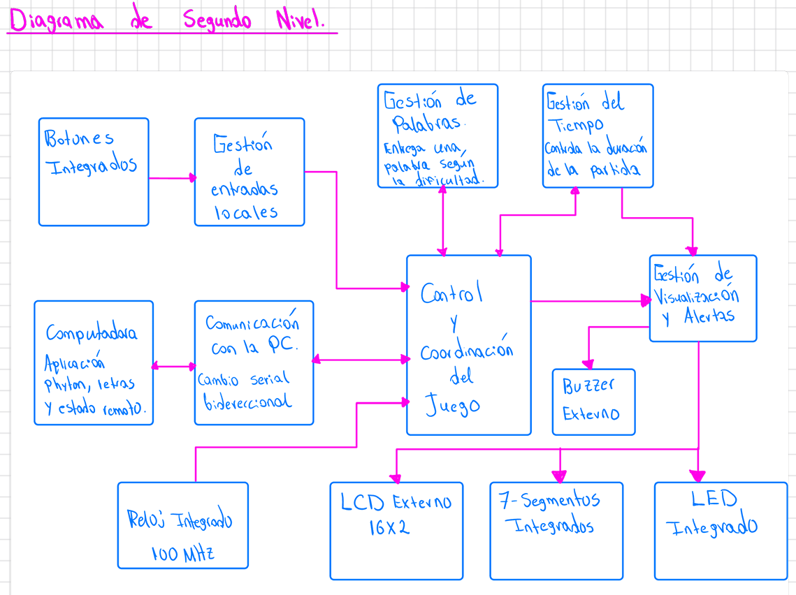
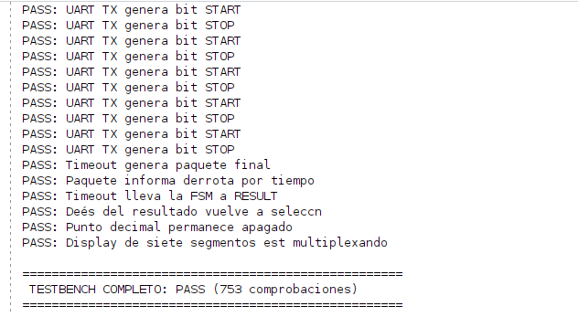

# Informe técnico: Ahorcado — juego electrónico FPGA / PC por enlace serial

<!--
PLANTILLA — Proyecto 2

Esta plantilla sigue las categorías de la rúbrica "Documentación técnica (informe)":
  - Fundamentación teórica ........................ 20%
  - Presentación de resultados ..................... 30%
  - Análisis e interpretación de resultados ........ 25%
  - Conclusiones y aprendizaje obtenido ............ 15%
  - Calidad y organización del documento ........... 10%

Reglas de formato que deben respetarse en TODO el documento:
  - Un único nivel de encabezado por jerarquía: ## para secciones principales,
    ### para subsecciones, #### para sub-subsecciones (p. ej. "Entradas",
    "Salidas", "Funcionamiento" y "Relación con el sistema" dentro de cada
    módulo). No usar "##" para estos últimos: rompe la estructura del
    documento y afecta "Calidad y organización".
  - Cada figura, tabla o forma de onda debe llevar numeración y una leyenda
    explicando qué muestra y qué se debe observar en ella.
  - La sección de resultados (10) debe ser explícita e independiente del
    análisis: aquí se presentan datos, capturas y mediciones; la
    interpretación crítica va en la sección 11.
  - Los tres integrantes escriben en este mismo archivo. Las marcas
    [INTEGRANTE 1/2/3] indican responsable según DISTRIBUCION_DOCUMENTACION_
    PROYECTO_2.txt y deben eliminarse antes de la entrega final.
-->

## Resumen

Este informe presenta el diseño e implementación de un juego electrónico de Ahorcado en el cual una FPGA Basys 3 concentra la totalidad del control de la partida y una aplicación de computadora personal, desarrollada en Python, actúa como terminal remota del jugador mediante un enlace serial UART a 115200 baudios. El sistema, integrado en el módulo superior `hangman_top`, está compuesto por un módulo de control `game_core` que implementa la máquina de estados `MENU → GAME → RESULT → MENU`, selecciona la palabra secreta mediante un generador pseudoaleatorio LFSR de 8 bits y consulta un banco de 50 palabras (`word_bank`) descrito como una memoria de solo lectura combinacional; un bloque `uart_game_interface` que encapsula un núcleo `uart_peripheral` y define un protocolo de aplicación propio basado en tramas con encabezado `0xA5` para notificar el inicio de partida, el resultado de cada letra y el resultado final; y los periféricos de visualización y retroalimentación local: `lcd_screen_controller`/`lcd_peripheral` para el LCD PmodCLP (HD44780), e `io_controller` para los displays de siete segmentos, el LED de estado y el buzzer. Las simulaciones unitarias e integradas del sistema, así como los procesos de síntesis, implementación y análisis de timing, se completaron satisfactoriamente, y el sistema demostró jugabilidad completa sobre la tarjeta Basys 3: selección de dificultad, recepción y validación de letras, actualización del LCD y de los displays, control del tiempo y de los intentos, y comunicación bidireccional con la aplicación de PC. Como trabajo pendiente queda principalmente la optimización del diseño y la incorporación de patrones sonoros diferenciados en el buzzer para distinguir con mayor claridad entre acierto, error, victoria y derrota.
---

## 1. Introducción

### 1.1 Contexto

Ahorcado (*Hangman*) es un juego clásico de adivinanza de palabras en el que el jugador propone letras, una a la vez, intentando descubrir una palabra secreta antes de agotar un número máximo de intentos fallidos. Este segundo proyecto del curso integra diseño digital secuencial, arquitectura modular de periféricos y comunicación serial para construir una aplicación interactiva completa entre una FPGA y una computadora personal. A diferencia del Proyecto 1, donde el control del juego dependía únicamente de entradas locales (*push buttons*), en este proyecto la FPGA debe coordinar su lógica de control con una aplicación externa ejecutada en la PC, comunicándose con ella mediante un periférico UART y presentando el estado de la partida de forma local en un LCD PmodCLP (compatible HD44780) y en displays de siete segmentos.
 
El proyecto se implementó sobre una tarjeta **Basys 3**, utilizando como periféricos de entrada los pulsadores `btnC`, `btnU` y `btnD`; como periféricos de salida un LCD de 16×2 (PmodCLP), cuatro displays de siete segmentos multiplexados, cuatro LED de estado y un buzzer; y como enlace de comunicación con la PC un puerto serie UART (`RsRx`/`RsTx`) a 115200 baudios.

### 1.2 Solución desarrollada

La solución desarrollada concentra toda la inteligencia y el control de la partida dentro de la FPGA, en el módulo superior `hangman_top`. Este módulo instancia y conecta los siguientes bloques:
 
- `game_core`: máquina de estados y *datapath* principal del juego. Selecciona la palabra secreta mediante un generador pseudoaleatorio LFSR de 8 bits interno, consulta el banco de palabras (`word_bank`), valida cada letra recibida, controla el tiempo restante y los intentos fallidos, y determina el resultado de la partida.
- `word_bank`: memoria de solo lectura combinacional con 50 palabras de longitud fija de 12 caracteres (rellenadas con espacios), junto con su longitud real, indexada de 0 a 49.
- `uart_game_interface`: encapsula un núcleo `uart_peripheral` y expone hacia `game_core` una letra recibida (`letter`, `letter_valid`); además construye y transmite hacia la PC las tramas del protocolo de aplicación (inicio de partida, resultado de letra, resultado final) a partir del estado que le entrega `game_core`.
- `lcd_screen_controller` y `lcd_peripheral`: el primero decide qué texto debe mostrarse en cada momento de la partida y el segundo controla físicamente el LCD PmodCLP a través de la interfaz de registros de 32 bits (`write_enable_i`, `addr_i`, `wdata_i`, `rdata_o`).
- `io_controller`: multiplexa los displays de siete segmentos (tiempo restante y contador de victorias) y genera la retroalimentación sonora del buzzer.
La PC ejecuta una aplicación en Python (`juego_uart.py`) que actúa únicamente como terminal remota: valida que la entrada del usuario sea una sola letra A–Z, la transmite por UART, y en un hilo independiente recibe e interpreta las tramas enviadas por la FPGA (identificadas por el byte de encabezado `0xA5`) para mostrar en consola el estado de la partida.

### 1.3 Alcance y limitaciones

El alcance logrado corresponde a un juego de Ahorcado completamente funcional y jugable de principio a fin sobre la Basys 3: el sistema permite seleccionar el modo de dificultad, inicia una partida con una palabra tomada del banco correspondiente, recibe letras desde la aplicación de PC por UART, valida cada letra como correcta, incorrecta o repetida, actualiza en tiempo real el LCD y los displays de siete segmentos, controla el conteo de intentos fallidos y el tiempo restante, determina victoria o derrota, y regresa automáticamente a la pantalla de selección de modo al finalizar. A nivel de jugabilidad, el sistema cumple con lo solicitado en el enunciado.
 
Dentro de las decisiones de diseño que se apartan del planteamiento inicial (`docs/diseño/diseño.md`) y que deben quedar documentadas como tales, en lugar de considerarse errores, están las siguientes:
 
- **Selección de modo simplificada.** El planteamiento original proponía un botón `BTN_SEL` para alternar cíclicamente entre `FACIL` y `DIFICIL`, confirmado con un botón `BTN_OK` independiente. La implementación final simplifica esta interacción utilizando `btnU` para iniciar directamente en modo fácil y `btnD` para iniciar directamente en modo difícil, detectados por flanco de subida dentro de `game_core`. Esta simplificación reduce la cantidad de pasos que debe realizar el jugador sin afectar la funcionalidad exigida.
- **Antirrebote de botones integrado en `game_core`.** En `hangman_top`, los pulsadores `btnC`, `btnU` y `btnD` se conectan directamente al módulo de control (como `rst`, `btn_easy` y `btn_hard`) sin pasar por un módulo dedicado de sincronización/antirrebote. Dentro de `game_core`, las señales `btn_easy_d`/`btn_hard_d` (un registro de un ciclo de retardo) se utilizan únicamente para detectar el flanco de subida de cada botón y generar un pulso de un solo ciclo; esto evita que una pulsación sostenida se interprete como múltiples eventos, pero no constituye un filtro antirrebote temporizado (de varios milisegundos) como el implementado en el Proyecto 1. En la práctica, el rebote mecánico no generó fallas perceptibles durante las pruebas, pero se documenta como una limitación de robustez del diseño.
- **LFSR interno, no modular.** El generador pseudoaleatorio no se implementó como un módulo independiente, según sugería el diagrama de tercer nivel del planteamiento, sino como un registro de 8 bits interno a `game_core`, con semilla fija (`8'h1`) cargada en cada reset. Esto significa que, tras cada reset general, la secuencia de palabras generada es siempre la misma para una misma serie de pulsaciones, aunque durante una sesión de juego continua el valor del LFSR sigue evolucionando de forma pseudoaleatoria en cada ciclo en que el sistema permanece en `MENU`.
- **Cobertura de longitudes del banco de palabras.** El banco de palabras cubre longitudes de 4 a 11 caracteres (no hasta 12), lo cual cumple igualmente el rango de 4 a 12 exigido por el enunciado, aunque no lo agota en su extremo superior.
Como limitaciones y oportunidades de mejora identificadas al cierre del proyecto se señalan:
 
- **Retroalimentación del LED de estado.** Los cuatro LED (`led[0]`–`led[3]`) indican correctamente en qué etapa se encuentra el sistema (menú, partida, resultado, dificultad), pero el esquema es mínimo y podría enriquecerse, por ejemplo, con patrones de parpadeo que refuercen visualmente el resultado de la partida.
- **Banco de palabras fijo.** Las 50 palabras están fijas en tiempo de síntesis dentro de `word_bank`; ampliar o modificar el vocabulario requiere resintetizar el diseño. Se identifica como mejora futura el uso de una memoria inicializable o cargable en tiempo de ejecución.
- **Optimización general del diseño.** Tanto en área/recursos como en la propia lógica de `game_core`, existe margen para optimizar el diseño (por ejemplo, separar con mayor claridad control y datapath, o modularizar el generador LFSR y el antirrebote de botones como bloques independientes, tal como se planteó originalmente).
- **Retroalimentación sonora poco diferenciada.** El buzzer no distingue con patrones claramente diferentes entre acierto, error, victoria y derrota, lo que limita la información que el jugador recibe únicamente por audio.
Estas limitaciones no impidieron demostrar el funcionamiento completo del juego y se retoman como mejoras futuras en la sección de conclusiones.
---

## 2. Objetivos

### 2.1 Objetivo general

Diseñar e implementar un juego electrónico de Ahorcado en el cual una FPGA Basys 3 concentre la selección de la palabra secreta, la validación de letras, el control del tiempo y de los intentos, y la comunicación bidireccional con una aplicación de computadora personal desarrollada en Python, que actúa como terminal remota del jugador mediante un enlace serial UART.

### 2.2 Objetivos específicos

- Diseñar un banco de al menos 50 palabras de longitud variable (4–12 caracteres), almacenado como memoria de solo lectura sintetizable dentro de la FPGA (`word_bank`).
- Implementar un generador pseudoaleatorio tipo LFSR para seleccionar la palabra secreta según el modo de dificultad elegido.
- Diseñar la máquina de estados y el *datapath* de control del juego (`game_core`), incluyendo la validación de letras correctas, incorrectas y repetidas, el conteo de intentos fallidos y el control del tiempo restante.
- Diseñar el periférico LCD para el módulo PmodCLP (HD44780), con interfaz estándar de registros de 32 bits (`lcd_peripheral`), y la lógica que decide el contenido a mostrar en cada pantalla del juego (`lcd_screen_controller`).
- Diseñar el periférico UART (`uart_peripheral`) y un protocolo de aplicación propio sobre UART (`uart_game_interface`) que notifique a la PC el inicio de partida, el resultado de cada letra y el resultado final.
- Implementar la aplicación de PC en Python (`juego_uart.py`) como interfaz de entrada/salida remota del jugador, sin lógica de control del juego.
- Implementar los indicadores locales de salida: displays de siete segmentos multiplexados (tiempo restante y contador de victorias), LED de estado y buzzer (`io_controller`).
- Verificar el sistema mediante testbenches autoverificables, tanto a nivel de módulo como de integración.
- Realizar simulación post-implementación temporizada del sistema completo.
- Comparar los resultados teóricos, simulados y experimentales obtenidos.

---

## 3. Especificaciones

### 3.1 Requisitos funcionales

| Requisito | Valor especificado | Implementación final |
|---|---:|---|
| Tamaño del banco de palabras | ≥ 50 palabras | 50 palabras, `word_bank` (índices 0–49) |
| Longitud de palabra | 4–12 caracteres | 4 a 11 caracteres según tabla `LENGTHS` de `word_bank` |
| Alfabeto permitido | A–Z sin tildes ni Ñ | Palabras almacenadas en mayúsculas A–Z, rellenadas con espacios a 12 caracteres |
| Selección de palabra | Pseudoaleatoria mediante LFSR | LFSR de 8 bits interno a `game_core`, semilla fija `8'h1` tras reset |
| Rango de índices modo fácil | Cualquier palabra ≥ 4 letras | `easy_index = lfsr % 50` (todo el banco, índices 0–49) |
| Rango de índices modo difícil | Solo palabras de 6+ letras | `hard_index = 20 + (lfsr % 30)` (índices 20–49, longitud 6–11) |
| No repetición inmediata | — | Si el índice candidato coincide con `last_index`, se incrementa en 1 (con retorno cíclico dentro del rango del modo) |
| Intentos fallidos máximos | 6 | Partida termina al alcanzar `wrong_count == 6` |
| Tiempo modo fácil | sugerido 60 s | `EASY_TIME = 60` s (parámetro de `game_core`) |
| Tiempo modo difícil | sugerido 45 s | `HARD_TIME = 45` s (parámetro de `game_core`) |
| Tiempo de resultado final | ≥ 3 s | `RESULT_TIME = 3` s antes de regresar a `MENU` |
| Letra repetida | Ignorar sin penalizar | Detectada mediante `used_letters`; no decrementa intentos ni reinicia tiempo |
| Contador de victorias | 00–99 | Saturado con reinicio a 0 al superar 99 (`victories == 99 ? 0 : victories+1`) |
| Baudios UART | 115200 | `BAUD_RATE = 115200` en `uart_peripheral`/`uart_game_interface` |
| Reloj de la FPGA | 100 MHz | `CLK100MHZ`, único reloj de entrada del sistema |
| Displays de 7 segmentos | ≥ 4 dígitos | 4 dígitos multiplexados en `io_controller` (`seg`, `an`, `dp`) — [verificar asignación exacta 2+2] |
| LED de estado | mínimo 1 LED, estados distinguibles | 4 LED: `led[0]` menú, `led[1]` partida, `led[2]` resultado, `led[3]` modo difícil |
| Buzzer | 3 patrones distintos | Generado en `io_controller` a partir de `letter_correct`, `letter_wrong`, `result_active`/`result_win` — [verificar patrones exactos] |
| Botón de reinicio general | Botón central | `btnC`, conectado como `rst` a todos los módulos de `hangman_top` |
| Selección de modo | Botones dedicados | `btnU` = fácil (`btn_easy`), `btnD` = difícil (`btn_hard`), detectados por flanco de subida dentro de `game_core` |
| Comunicación requerida | UART asíncrono | Enlace bidireccional `RsRx`/`RsTx` mediante `uart_peripheral`, encapsulado por `uart_game_interface` |

### 3.2 Protocolo de aplicación sobre UART

La comunicación entre la FPGA y la aplicación ejecutada en la computadora se realiza mediante una interfaz UART configurada a **115200 baudios, 8 bits de datos, sin bit de paridad y un bit de parada (8N1)**. Sobre esta comunicación física se implementó un protocolo de aplicación que permite enviar las letras ingresadas por el usuario hacia la FPGA y transmitir desde la FPGA la información correspondiente al estado y resultado de la partida.

La comunicación es bidireccional. En la dirección **PC → FPGA**, se transmite directamente el carácter ASCII correspondiente a la letra seleccionada por el usuario. En la dirección **FPGA → PC**, se utilizan paquetes estructurados que comienzan con el byte de encabezado `0xA5`, seguido por un byte que identifica el tipo de mensaje y los campos correspondientes.

#### Trama física UART

Cada byte se transmite utilizando el formato **8N1**, por lo que una trama UART está compuesta por un bit de inicio (`START`), ocho bits de datos y un bit de parada (`STOP`). Los bits de datos se transmiten comenzando por el bit menos significativo (**LSB first**).

```text
         START          8 bits de datos                STOP
           │                    │                        │
           ▼                    ▼                        ▼
Reposo ─── 0 ─── D0 ─ D1 ─ D2 ─ D3 ─ D4 ─ D5 ─ D6 ─ D7 ─── 1 ─── Reposo
                  └────────── LSB → MSB ──────────┘
```

Para una velocidad de transmisión de 115200 baudios, la duración aproximada de cada bit se obtiene mediante:

$$
T_{bit}=\frac{1}{115200}
$$

por lo tanto:

$$
T_{bit}\approx 8.68\mu s
$$

Como cada trama contiene diez bits en total —un bit de inicio, ocho bits de datos y un bit de parada—, el tiempo aproximado requerido para transmitir un byte es:

$$
T_{byte}=10(8.68\mu s)\approx86.8\mu s
$$

La FPGA utiliza un reloj principal de 100 MHz, correspondiente a un período de 10 ns. Por esta razón, el número aproximado de ciclos de reloj disponibles durante la transmisión de cada bit UART es:

$$
N_{ciclos/bit}=
\frac{100\,000\,000}{115200}
\approx868
$$

Este valor es utilizado por el periférico UART para establecer la temporización necesaria durante los procesos de transmisión y recepción.

#### Mensajes PC → FPGA

En la dirección **PC → FPGA**, la computadora transmite un único byte ASCII correspondiente a la letra introducida por el usuario. Los caracteres válidos se encuentran dentro del intervalo ASCII comprendido entre `A` y `Z`, es decir:

$$
'A'=0x41
$$

hasta:

$$
'Z'=0x5A
$$

Algunos ejemplos de los valores transmitidos se muestran en la siguiente tabla:

| Entrada del usuario | Byte ASCII transmitido |
|---|---|
| `A` | `0x41` |
| `B` | `0x42` |
| `C` | `0x43` |
| `Z` | `0x5A` |

La aplicación de PC convierte la entrada del usuario a mayúscula antes de realizar la transmisión. Adicionalmente, la lógica implementada en la FPGA verifica que el byte recibido corresponda a una letra comprendida entre `A` y `Z`. Cualquier byte que se encuentre fuera de este intervalo se descarta sin modificar el estado de la partida.

El proceso de recepción puede representarse de forma general de la siguiente manera:

```text
Usuario introduce una letra
          │
          ▼
Aplicación de PC
          │
Conversión a mayúscula
          │
          ▼
   Byte ASCII A-Z
          │
          ▼
        UART
          │
          ▼
         FPGA
          │
          ▼
Validación del rango A-Z
          │
          ▼
     Lógica del juego
```

#### Mensajes FPGA → PC

Para la comunicación en dirección **FPGA → PC** se definió un protocolo basado en paquetes de longitud conocida. Todos los paquetes comienzan con el byte `0xA5`, utilizado como encabezado o byte de sincronización.

El segundo byte del paquete identifica el tipo de mensaje transmitido:

| Tipo de mensaje | Código | Función |
|---|---|---|
| Inicio de partida | `0x01` | Informa el inicio de una nueva partida |
| Resultado de letra | `0x02` | Informa el resultado de una letra procesada |
| Resultado final | `0x03` | Informa la finalización de la partida |

De esta manera, la aplicación de PC busca inicialmente el encabezado `0xA5` y posteriormente analiza el segundo byte para determinar la estructura y longitud del resto del paquete.

##### Paquete de inicio de partida

Cuando se inicia una nueva partida, la FPGA transmite el siguiente paquete:

```text
A5 01 MODO LONGITUD
```

La estructura byte a byte se muestra en la siguiente tabla:

| Byte | Campo | Significado |
|---:|---|---|
| 0 | `0xA5` | Encabezado del protocolo |
| 1 | `0x01` | Tipo de mensaje: inicio de partida |
| 2 | `MODO` | Modo de dificultad seleccionado |
| 3 | `LONGITUD` | Cantidad de caracteres de la palabra seleccionada |

**Longitud total del paquete: 4 bytes.**

El campo `MODO` permite indicar a la aplicación de PC la dificultad seleccionada para la nueva partida, mientras que el campo `LONGITUD` contiene la cantidad de caracteres de la palabra seleccionada por la FPGA.

##### Paquete de resultado de una letra

Cada vez que una letra válida es procesada por la lógica del juego, la FPGA transmite un paquete con la siguiente estructura:

```text
A5 02 LETRA RESULTADO INTENTOS LONGITUD PATRON[12]
```

La distribución de los bytes es:

| Byte | Campo | Significado |
|---:|---|---|
| 0 | `0xA5` | Encabezado del protocolo |
| 1 | `0x02` | Tipo de mensaje: resultado de una letra |
| 2 | `LETRA` | Código ASCII de la letra procesada |
| 3 | `RESULTADO` | Resultado de la validación de la letra |
| 4 | `INTENTOS` | Cantidad de intentos restantes |
| 5 | `LONGITUD` | Longitud de la palabra seleccionada |
| 6–17 | `PATRON[12]` | Estado actualizado de la palabra |

**Longitud total del paquete: 18 bytes.**

El campo `RESULTADO` utiliza los siguientes códigos:

| Código | Significado |
|---|---|
| `0x01` | Letra correcta |
| `0x02` | Letra incorrecta |
| `0x03` | Letra repetida |

El campo `PATRON[12]` contiene la representación actual de la palabra. Las posiciones que ya fueron descubiertas contienen las letras correspondientes, mientras que las posiciones todavía ocultas se representan mediante el carácter utilizado por la implementación para indicar una letra no revelada.

Por ejemplo, para una palabra como `CASA`, después de procesar correctamente la letra `A`, el patrón representaría:

```text
Palabra:    C A S A
Patrón:     _ A _ A
```

De esta manera, la aplicación de PC puede mostrar el progreso de la partida utilizando directamente la información proporcionada por la FPGA, sin implementar localmente la lógica de validación del juego.

##### Paquete de resultado final

Cuando la partida finaliza, la FPGA transmite el siguiente paquete:

```text
A5 03 GANO CAUSA LONGITUD PALABRA[12]
```

La distribución byte a byte es:

| Byte | Campo | Significado |
|---:|---|---|
| 0 | `0xA5` | Encabezado del protocolo |
| 1 | `0x03` | Tipo de mensaje: resultado final |
| 2 | `GANO` | Indica el resultado de la partida |
| 3 | `CAUSA` | Indica la causa de finalización |
| 4 | `LONGITUD` | Longitud de la palabra |
| 5–16 | `PALABRA[12]` | Palabra completa seleccionada |

**Longitud total del paquete: 17 bytes.**

El campo `CAUSA` permite identificar la condición que produjo la finalización de la partida:

| Código | Significado |
|---|---|
| `0x01` | Victoria |
| `0x02` | Derrota por agotar los seis intentos |
| `0x03` | Derrota por agotamiento del tiempo |

El campo `PALABRA[12]` contiene la palabra completa seleccionada para la partida. Esto permite que la aplicación de PC muestre la solución al finalizar el juego, tanto en caso de victoria como de derrota.

#### Resumen del protocolo de aplicación

La siguiente tabla resume los mensajes utilizados en la comunicación entre la computadora y la FPGA:

| Dirección | Mensaje | Estructura | Longitud |
|---|---|---|---:|
| PC → FPGA | Letra | `LETRA` | 1 byte |
| FPGA → PC | Inicio de partida | `A5 01 MODO LONGITUD` | 4 bytes |
| FPGA → PC | Resultado de letra | `A5 02 LETRA RESULTADO INTENTOS LONGITUD PATRON[12]` | 18 bytes |
| FPGA → PC | Resultado final | `A5 03 GANO CAUSA LONGITUD PALABRA[12]` | 17 bytes |

La estructura propuesta mantiene toda la lógica de control de la partida dentro de la FPGA. La aplicación de PC se limita a transmitir las letras introducidas por el usuario e interpretar los paquetes enviados por la FPGA para presentar el estado de la partida.

### 3.3 Interfaz estándar de periféricos (bus de 32 bits)

Para facilitar la integración entre los diferentes módulos del sistema, los periféricos UART y LCD utilizan una interfaz digital común de **32 bits**. Esta interfaz permite realizar operaciones de lectura y escritura sobre los registros internos de cada periférico mediante un esquema de direccionamiento sencillo.

La interfaz está compuesta por las siguientes señales:

| Señal | Dirección | Ancho | Descripción |
|---|---|---:|---|
| `clk_i` | Entrada | 1 bit | Reloj principal utilizado para sincronizar las operaciones del periférico |
| `rst_i` | Entrada | 1 bit | Señal de reinicio del periférico |
| `write_enable_i` | Entrada | 1 bit | Habilita una operación de escritura cuando se encuentra en `1` |
| `addr_i` | Entrada | 2 bits | Selecciona uno de los registros internos del periférico |
| `wdata_i` | Entrada | 32 bits | Contiene el dato que se desea escribir en el registro seleccionado |
| `rdata_o` | Salida | 32 bits | Contiene el dato leído desde el registro seleccionado |

El campo de dirección `addr_i[1:0]` permite seleccionar hasta cuatro registros diferentes:

| `addr_i[1:0]` | Registro seleccionable |
|---|---|
| `2'b00` | Registro 0 |
| `2'b01` | Registro 1 |
| `2'b10` | Registro 2 |
| `2'b11` | Registro 3 |

El funcionamiento general de la interfaz depende del valor de `write_enable_i`.

Cuando:

```text
write_enable_i = 1
```

se realiza una operación de **escritura**, por lo que el periférico utiliza `addr_i` para seleccionar el registro que será modificado y toma la información presente en `wdata_i[31:0]`.

De forma general:

```text
                 addr_i[1:0]
                      │
                      ▼
                ┌───────────┐
wdata_i[31:0] ─►│ Periférico│
                │           │
write_enable=1 ─►│ Registros │
                └───────────┘
```

Cuando:

```text
write_enable_i = 0
```

la operación corresponde a una **lectura**. En este caso, `addr_i` selecciona el registro interno cuyo contenido se coloca en `rdata_o[31:0]`.

```text
                 addr_i[1:0]
                      │
                      ▼
                ┌───────────┐
                │ Periférico│
                │           │────► rdata_o[31:0]
write_enable=0 ─►│ Registros │
                └───────────┘
```

El uso de una interfaz común permite que los módulos encargados de controlar el UART y el LCD accedan a sus respectivos periféricos de una manera uniforme. Aunque los registros internos y la función de cada periférico son diferentes, el mecanismo utilizado para leerlos y escribirlos se mantiene igual.

---

### 3.4 Registros del periférico UART

El periférico UART utiliza tres direcciones de la interfaz estándar para almacenar los datos de transmisión, los datos recibidos y la información de control y estado.

El mapa de registros utilizado se muestra en la siguiente tabla:

| `addr_i[1:0]` | Registro | Función |
|---|---|---|
| `2'b00` | `DATA_TX` | Almacena el byte que será transmitido por UART |
| `2'b01` | `DATA_RX` | Almacena el último byte recibido por UART |
| `2'b10` | `CONTROL/STATUS` | Controla la transmisión e informa el estado de recepción |
| `2'b11` | Reservado | No utilizado |

#### Registro `DATA_TX`

El registro `DATA_TX`, ubicado en la dirección:

```text
addr_i = 2'b00
```

se utiliza para almacenar el dato que será transmitido hacia la computadora.

Aunque la interfaz de periféricos posee un ancho de 32 bits, el protocolo UART transmite datos de 8 bits. Por esta razón, solamente los bits `[7:0]` contienen información útil.

| Bits | Campo | Descripción |
|---|---|---|
| `[7:0]` | `DATA_TX` | Byte que será transmitido |
| `[31:8]` | Reservado | No utilizado para el dato UART |

El proceso general de transmisión es:

```text
wdata_i[7:0]
      │
      ▼
   DATA_TX
      │
      ▼
Transmisor UART
      │
      ▼
    uart_tx
      │
      ▼
      PC
```

Primero se escribe el byte que se desea transmitir en `DATA_TX`. Posteriormente, mediante el registro `CONTROL/STATUS`, se solicita al periférico que inicie la transmisión.

#### Registro `DATA_RX`

El registro `DATA_RX`, ubicado en:

```text
addr_i = 2'b01
```

almacena el último byte recibido desde la computadora.

| Bits | Campo | Descripción |
|---|---|---|
| `[7:0]` | `DATA_RX` | Byte recibido mediante UART |
| `[31:8]` | Reservado | Sin información del dato recibido |

El flujo general de recepción es:

```text
      PC
      │
      ▼
   uart_rx
      │
      ▼
Receptor UART
      │
      ▼
   DATA_RX
      │
      ▼
uart_game_interface
      │
      ▼
 Lógica del juego
```

Cuando el receptor completa correctamente la recepción de un byte, este se almacena en `DATA_RX` y se genera la indicación correspondiente de que existe un nuevo dato disponible.

#### Registro `CONTROL/STATUS`

El registro `CONTROL/STATUS`, ubicado en:

```text
addr_i = 2'b10
```

contiene las señales necesarias para iniciar una transmisión y determinar si existe un nuevo dato recibido.

Los campos principales utilizados son:

| Bit | Campo | Función |
|---:|---|---|
| 0 | `send` / estado de transmisión | Permite iniciar o indicar el estado de una transferencia UART |
| 1 | `new_rx` | Indica que se ha recibido un nuevo byte |
| `[31:2]` | Reservados | Sin uso para las funciones principales |

El campo `send` se relaciona con el proceso de transmisión. Una vez almacenado el byte correspondiente en `DATA_TX`, este campo permite solicitar el inicio de la transferencia.

Durante la transmisión, el periférico mantiene internamente el estado necesario para evitar iniciar una nueva transferencia antes de finalizar la actual.

Por otra parte, `new_rx` indica que el receptor UART ha completado la recepción de un nuevo byte y que este se encuentra disponible en `DATA_RX`.

El controlador que utiliza el periférico debe leer el dato recibido y posteriormente limpiar la indicación `new_rx`, permitiendo identificar correctamente la llegada del siguiente byte.

El procedimiento de recepción puede resumirse como:

```text
Byte recibido
     │
     ▼
 DATA_RX ← byte
     │
     ▼
 new_rx = 1
     │
     ▼
Controlador detecta new_rx
     │
     ▼
Lee DATA_RX
     │
     ▼
Limpia new_rx
```

De esta forma, los registros `DATA_TX`, `DATA_RX` y `CONTROL/STATUS` permiten separar la transferencia física de los datos de la lógica encargada de interpretar el protocolo del juego.

---

### 3.5 Registros del periférico LCD

El periférico LCD también utiliza la interfaz estándar de 32 bits. Para su operación se definieron dos registros principales: `CONTROL/STATUS` y `DATA`.

El mapa de registros es:

| `addr_i[1:0]` | Registro | Función |
|---|---|---|
| `2'b00` | `CONTROL/STATUS` | Control y estado del periférico LCD |
| `2'b01` | `DATA` | Dato o comando que será enviado al LCD |
| `2'b10` | Reservado | No utilizado |
| `2'b11` | Reservado | No utilizado |

#### Registro `CONTROL/STATUS`

El registro `CONTROL/STATUS` permite iniciar operaciones sobre el LCD, seleccionar si la información enviada corresponde a un comando o a un carácter, solicitar operaciones especiales y conocer el estado actual del periférico.

Los campos utilizados son:

| Bit | Campo | Tipo | Función |
|---:|---|---|---|
| 0 | `start` | Control | Inicia una operación con el LCD |
| 1 | `rs` | Control | Selecciona entre comando (`0`) y dato (`1`) |
| 2 | `clear` | Control | Solicita limpiar la pantalla |
| 3 | `home` | Control | Solicita regresar el cursor a la posición inicial |
| 8 | `busy` | Estado | Indica que el periférico se encuentra ocupado |
| 9 | `done` | Estado | Indica la finalización de una operación |
| `[31:10]` | Reservado | — | Sin uso |
| `[7:4]` | Reservado | — | Sin uso |

##### Campo `start`

El bit `start` solicita al periférico iniciar una nueva operación utilizando la información previamente almacenada en el registro `DATA` y la configuración del campo `rs`.

Una vez aceptada la solicitud, el periférico realiza internamente la secuencia temporal requerida por el controlador del LCD.

##### Campo `rs`

El campo `rs` determina la interpretación del byte almacenado en `DATA`:

```text
rs = 0 → comando
rs = 1 → carácter/dato
```

Por ejemplo, un valor como `0x01` con `rs = 0` corresponde a una instrucción para el LCD, mientras que un código ASCII como `0x41` con `rs = 1` corresponde al carácter `A`.

##### Campo `clear`

El campo `clear` solicita una operación de limpieza de pantalla. Esta operación corresponde al comando:

```text
0x01
```

del controlador compatible con HD44780.

##### Campo `home`

El campo `home` solicita regresar el cursor a su posición inicial sin utilizarlo como una escritura normal de carácter.

##### Campo `busy`

El bit `busy` indica que el periférico se encuentra realizando una operación.

```text
busy = 0 → periférico disponible
busy = 1 → periférico ocupado
```

Mientras `busy` se encuentra activo, el controlador debe esperar antes de solicitar una nueva operación.

##### Campo `done`

El campo `done` permite indicar que la última operación aceptada por el periférico ha finalizado.

De forma simplificada:

```text
Solicitud
   │
   ▼
start = 1
   │
   ▼
busy = 1
   │
   ▼
Operación LCD
   │
   ▼
busy = 0
done = 1
```

#### Registro `DATA`

El registro `DATA`, ubicado en:

```text
addr_i = 2'b01
```

almacena el byte que será enviado al LCD.

| Bits | Campo | Descripción |
|---|---|---|
| `[7:0]` | `data` | Código ASCII o instrucción del LCD |
| `[31:8]` | Reservado | Sin uso |

El significado de los bits `[7:0]` depende del valor de `rs`.

Por ejemplo:

```text
DATA = 0x41
RS   = 1
```

representa el carácter:

```text
'A'
```

mientras que:

```text
DATA = 0x01
RS   = 0
```

representa el comando para limpiar la pantalla.

El flujo general de una escritura puede representarse como:

```text
        DATA[7:0]
            │
            ▼
     lcd_peripheral
            │
       ┌────┴────┐
       │         │
      RS       DATA[7:0]
       │         │
       └────┬────┘
            ▼
        PmodCLP
```

#### Secuencia de inicialización

Antes de utilizar normalmente la pantalla, el periférico ejecuta una secuencia de inicialización para configurar el controlador LCD.

Los comandos principales utilizados son:

| Comando | Función |
|---|---|
| `0x38` | Configura interfaz de 8 bits y operación con dos líneas |
| `0x0C` | Enciende el display |
| `0x01` | Limpia el contenido de la pantalla |
| `0x06` | Configura el incremento automático del cursor |

La secuencia puede resumirse como:

```text
Encendido
   │
   ▼
  0x38
   │
   ▼
  0x0C
   │
   ▼
  0x01
   │
   ▼
  0x06
   │
   ▼
LCD preparado
```

El periférico también incorpora los tiempos de espera necesarios entre operaciones, debido a que el controlador del LCD no procesa las instrucciones de forma instantánea. La señal `busy` permite que el controlador de pantalla conozca cuándo puede solicitar una nueva operación.

---

### 3.6 Requisitos eléctricos

El sistema se implementa sobre una tarjeta **Basys 3**, utilizando el reloj principal de 100 MHz y los diferentes pines de entrada y salida requeridos por los periféricos del proyecto.

Las señales digitales externas utilizadas por el diseño se configuran con el estándar lógico:

```text
LVCMOS33
```

correspondiente a niveles lógicos de **3.3 V**.

La asignación entre las señales descritas en SystemVerilog y los pines físicos de la FPGA se realiza mediante el archivo de restricciones del proyecto (`.xdc`).

Entre las principales conexiones físicas utilizadas se encuentran:

- reloj principal de 100 MHz;
- señales UART `RsRx` y `RsTx`;
- pulsadores de selección, confirmación y reinicio;
- señales del LCD;
- displays de siete segmentos;
- LEDs de estado;
- salida correspondiente al buzzer.

#### Conexión del LCD

El PmodCLP utiliza una interfaz paralela de 8 bits. Las principales señales de control utilizadas por el diseño son:

| Señal | Función |
|---|---|
| `lcd_data[7:0]` | Bus paralelo de datos/comandos |
| `lcd_rs` | Selección entre comando y dato |
| `lcd_rw` | Selección de lectura/escritura |
| `lcd_e` | Señal de habilitación del LCD |

En la implementación desarrollada, la comunicación con el LCD se utiliza principalmente para realizar operaciones de escritura, por lo que el periférico controla las señales necesarias para enviar comandos y caracteres respetando las temporizaciones correspondientes.

#### Pulsadores

Los pulsadores de la Basys 3 se utilizan como entradas digitales para realizar las funciones de:

- selección del modo de dificultad;
- confirmación de la selección;
- reinicio general del sistema.

Debido a que los pulsadores son dispositivos mecánicos, una única pulsación puede producir múltiples transiciones eléctricas durante un intervalo corto. Por esta razón, las señales asociadas a los botones deben acondicionarse antes de ser utilizadas por la lógica secuencial del sistema.

El acondicionamiento permite obtener una señal estable que pueda ser interpretada correctamente por las máquinas de estados y registros del diseño.

#### UART

La comunicación UART utiliza dos señales independientes:

```text
RsRx → recepción hacia la FPGA
RsTx → transmisión desde la FPGA
```

La comunicación es bidireccional, pero cada dirección posee su propia línea física. Al tratarse de UART, no se requiere una línea de reloj compartida entre la computadora y la FPGA; la sincronización se realiza mediante la configuración común de 115200 baudios y la estructura `START + DATA + STOP`.

En conjunto, las restricciones eléctricas y de pines permiten relacionar la descripción RTL del sistema con los recursos físicos disponibles en la tarjeta FPGA y los periféricos externos conectados.

## 4. Fundamentación teórica

### 4.1 Lógica combinacional y secuencial

La lógica combinacional describe salidas que dependen únicamente de los valores actuales de sus entradas, sin memoria del pasado; en `game_core` este tipo de lógica se utiliza, por ejemplo, en el cálculo de `match_mask` (posiciones de la palabra donde aparece la letra recibida), en `valid_mask` (máscara de bits válidos según la longitud de la palabra) y en la selección del índice candidato (`candidate_index`) según el modo y el último índice usado. Todos estos bloques se describen mediante `always_comb`, cuidando cubrir todos los caminos posibles para evitar la inferencia de *latches* no intencionados.
 
La lógica secuencial, en cambio, almacena información entre flancos de reloj mediante flip-flops. En `game_core` esto se traduce en registros como `state` (estado de la FSM), `selected_word`, `word_length`, `revealed_mask`, `used_letters`, `wrong_count`, `time_left`, `victories`, `lfsr` y `last_index`, todos actualizados de forma síncrona en `always_ff @(posedge clk)` mediante asignaciones no bloqueantes (`<=`), de modo que reflejan el nuevo estado del sistema en el siguiente flanco de reloj.

### 4.2 Máquinas de estados finitos

Una máquina de estados finitos (FSM) describe el comportamiento de un sistema secuencial como un conjunto finito de estados, con condiciones que determinan las transiciones entre ellos y salidas que pueden depender únicamente del estado actual (Moore) o también de las entradas presentes (Mealy). En `game_core` se implementa una FSM de tres estados, `typedef enum logic [1:0] {MENU, GAME, RESULT} state_t`, con las siguientes transiciones:
 
- **`MENU → GAME`**: ocurre cuando se detecta un pulso en `btn_easy` o `btn_hard` (`easy_pulse`/`hard_pulse`); en la misma transición se carga la palabra seleccionada, se reinician los contadores de la partida (`revealed_mask`, `used_letters`, `wrong_count`) y se carga el tiempo correspondiente al modo (`EASY_TIME` o `HARD_TIME`).
- **`GAME → RESULT`**: ocurre por tres condiciones mutuamente excluyentes: (a) todas las posiciones de la palabra quedan reveladas (`(revealed_mask | match_mask) == valid_mask`), lo que produce victoria y aumenta el contador de `victories`; (b) el conteo de letras incorrectas alcanza seis (`wrong_count == 5` antes de incrementar a 6), lo que produce derrota por intentos; o (c) el temporizador de la partida llega a cero (`time_left <= 1` al expirar el conteo de segundos), lo que produce derrota por tiempo.
- **`RESULT → MENU`**: ocurre automáticamente transcurrido el tiempo de resultado configurado (`RESULT_TIME = 3` s), contado con la misma base de un segundo (`sec_count == CLK_FREQ-1`) que se usa durante la partida.
Las señales combinacionales `menu_active`, `game_active` y `result_active` se derivan directamente del estado actual (`state == MENU`, etc.), por lo que corresponden a salidas de tipo Moore.

### 4.3 Registro de desplazamiento con retroalimentación lineal (LFSR)

Un registro de desplazamiento con retroalimentación lineal (LFSR) genera una secuencia pseudoaleatoria desplazando sus bits en cada ciclo de reloj e insertando en el bit menos significativo el resultado de una función XOR aplicada sobre un subconjunto fijo de bits internos (los llamados *taps*). En `game_core` se implementó un LFSR de configuración Fibonacci de 8 bits:
 
```systemverilog
lfsr <= { lfsr[6:0], lfsr[7] ^ lfsr[5] ^ lfsr[4] ^ lfsr[3] };
```
 
Los *taps* utilizados (bits 7, 5, 4 y 3) corresponden al polinomio primitivo x⁸+x⁶+x⁵+x⁴+1, que produce una secuencia de longitud máxima de 255 estados (2⁸−1) para cualquier semilla distinta de cero. Precisamente por esto la semilla no puede ser `8'h0`: con esa semilla la retroalimentación XOR siempre produce cero y el registro queda permanentemente bloqueado en el estado absorbente `00000000`. En la implementación, el registro se inicializa con la semilla `8'h1` en cada reset, y avanza un paso en cada ciclo de reloj mientras el sistema permanece en el estado `MENU`, lo que en la práctica produce una posición diferente del LFSR en el instante exacto en que el jugador presiona `btnU` o `btnD`.
 
El valor del LFSR se mapea a un índice del banco de palabras mediante una operación de módulo, distinta según el modo:
 
- **Modo fácil**: `easy_index = lfsr % 50`, cubriendo la totalidad de las 50 palabras del banco.
- **Modo difícil**: `hard_index = 20 + (lfsr % 30)`, restringiendo la selección al subrango de índices 20 a 49, que corresponden en `word_bank` a las palabras de 6 o más caracteres.
Adicionalmente, si el índice candidato coincide con el índice de la última palabra utilizada (`last_index`), se incrementa en uno (con retorno cíclico dentro del rango del modo correspondiente), como estrategia simple para evitar repetir la misma palabra en dos partidas consecutivas.

### 4.4 Memorias de solo lectura (ROM) sintetizables

Una memoria de solo lectura (ROM) sintetizable puede describirse en SystemVerilog como un arreglo constante (`localparam`) indexado mediante una señal de entrada, resuelto en tiempo de síntesis mediante lógica combinacional o bloques de memoria de la FPGA, según el tamaño y las herramientas de síntesis. En este proyecto, `word_bank` implementa dos arreglos constantes paralelos e indexados de 0 a 49:
 
- `WORDS[0:49]`, de tipo `logic [95:0]`, donde cada palabra se almacena como una cadena de 12 caracteres ASCII (96 bits), rellenando con espacios los caracteres sobrantes cuando la palabra es más corta que 12 letras. Esto permite representar palabras de longitud variable con un ancho de bus fijo, sin necesidad de codificar la longitud dentro de la misma palabra.
- `LENGTHS[0:49]`, de tipo `logic [3:0]`, con la longitud real (sin el relleno de espacios) de cada palabra, usada por `game_core` para saber cuántas de las 12 posiciones son válidas (`valid_mask`) y para truncar la palabra al desplegarla.
El acceso se resuelve con un bloque combinacional (`always_comb`) que verifica que el índice sea menor que 50 antes de leer el arreglo, devolviendo la primera palabra del banco como valor por defecto en caso de un índice fuera de rango, lo cual evita la inferencia de un *latch* al cubrir explícitamente todos los caminos de la asignación.

### 4.5 Protocolo UART asíncrono

UART (*Universal Asynchronous Receiver-Transmitter*) es un método de comunicación serial utilizado para transmitir información entre dispositivos digitales. Su principal característica es que la comunicación es **asíncrona**, lo que significa que el transmisor y el receptor no comparten una señal física de reloj. En su lugar, ambos dispositivos deben configurarse previamente con una velocidad de transmisión compatible, denominada **baud rate**.

En este proyecto se utiliza una configuración UART de **115200 baudios y formato 8N1**, donde:

- **8** indica que se transmiten ocho bits de datos.
- **N** (*None*) indica que no se utiliza bit de paridad.
- **1** indica que se utiliza un bit de parada.

#### Estructura de una trama UART

En estado de reposo, la línea UART permanece en nivel lógico alto (`1`). El comienzo de una transmisión se identifica mediante un **bit de inicio o START**, que lleva la línea a nivel lógico bajo (`0`).

Posteriormente se transmiten los ocho bits correspondientes al dato, comenzando por el bit menos significativo (**LSB first**). Finalmente, se transmite un **bit de parada o STOP** en nivel lógico alto.

La estructura general es:

```text
                  8 bits de datos
              ┌─────────────────────┐
              │                     │
Reposo  START D0 D1 D2 D3 D4 D5 D6 D7  STOP  Reposo
   1      0    ─────── LSB → MSB ─────    1      1
```

Por lo tanto, para transmitir un byte se requieren un total de **10 bits**:

$$
N_{bits}=1+8+1=10
$$

#### Baud rate y duración del bit

El *baud rate* determina la cantidad de símbolos transmitidos por segundo. Para la UART utilizada en este proyecto, cada símbolo corresponde a un bit, por lo que para una configuración de 115200 baudios la duración teórica de cada bit es:

$$
T_{bit}=\frac{1}{115200}
$$

$$
T_{bit}\approx8.68\\mu s
$$

Debido a que una trama completa contiene 10 bits, el tiempo aproximado para transmitir un byte es:

$$
T_{byte}=10T_{bit}
$$

$$
T_{byte}\approx86.8\\mu s
$$

El sistema implementado en la FPGA utiliza un reloj de **100 MHz**, cuyo período es:

$$
T_{clk}=\frac{1}{100\times10^6}=10\,ns
$$

Por lo tanto, la cantidad teórica de ciclos de reloj correspondientes a un bit UART es:

$$
N_{clk}=\frac{100\,000\,000}{115200}\approx868.06
$$

En la implementación se utiliza una división entera:

```systemverilog
BIT_CLKS = CLK_FREQ / BAUD_RATE;
```

por lo que se utilizan **868 ciclos de reloj por bit**.

#### Recepción y muestreo de los datos

Debido a que UART no proporciona una señal de reloj junto con los datos, el receptor debe determinar los instantes apropiados para realizar el muestreo de la señal.

La recepción comienza cuando se detecta una transición desde el estado de reposo hacia un nivel lógico bajo, correspondiente a un posible bit de inicio.

En la implementación se espera aproximadamente la mitad de la duración de un bit:

$$
HALF\_CLKS=\frac{BIT\_CLKS}{2}
$$

$$
HALF\_CLKS=\frac{868}{2}=434
$$

Después de esta espera se vuelve a comprobar la señal. Si continúa en nivel bajo, se considera válido el bit START. Esta comprobación permite evitar que una transición momentánea sea interpretada inmediatamente como el comienzo de una trama válida.

Posteriormente, los bits de datos se muestrean en intervalos correspondientes aproximadamente a un período completo de bit.

De forma conceptual:

```text
Detección
de START
    │
    ▼
Espera aproximadamente
medio período de bit
    │
    ▼
Confirmación de START
    │
    ▼
Muestreo de D0
    │
  1 Tbit
    ▼
Muestreo de D1
    │
   ...
    ▼
Muestreo de D7
    │
    ▼
Verificación de STOP
```

Finalmente, el receptor comprueba que el bit de parada se encuentre en nivel lógico alto. Si esta condición se cumple, el byte recibido se considera válido y puede ser utilizado por el resto del sistema.

En este proyecto, estos principios se implementan dentro de `uart_peripheral`, que se encarga de transformar la señal serial UART en bytes de 8 bits y de realizar el proceso inverso durante la transmisión.

---

### 4.6 Controlador LCD HD44780 / PmodCLP

El sistema utiliza un módulo LCD alfanumérico de **16 caracteres por 2 líneas**, controlado mediante una interfaz compatible con el controlador **HD44780**. Este tipo de pantalla permite representar caracteres alfanuméricos mediante el envío de comandos y datos desde un sistema digital.

A diferencia de UART, que utiliza una transmisión serial, el LCD empleado en el proyecto utiliza una **interfaz paralela de 8 bits**, permitiendo transmitir simultáneamente los ocho bits correspondientes a un comando o carácter.

#### Interfaz paralela

Las principales señales utilizadas para controlar el LCD son:

| Señal | Función |
|---|---|
| `DATA[7:0]` | Bus paralelo utilizado para transmitir comandos o caracteres |
| `RS` | Selecciona entre registro de instrucciones y registro de datos |
| `RW` | Selecciona entre operación de lectura y escritura |
| `E` | Señal de habilitación utilizada para ejecutar la transferencia |

La señal `RS` permite determinar la naturaleza del byte enviado:

```text
RS = 0 → instrucción/comando
RS = 1 → dato o carácter
```

Por ejemplo, cuando se desea enviar el carácter `A`, cuyo código ASCII es `0x41`, se coloca dicho valor en el bus `DATA[7:0]` y se selecciona la operación correspondiente a datos mediante `RS`.

Por otra parte, para enviar una instrucción de configuración, `RS` se mantiene en `0`.

La señal `E` (*Enable*) permite indicar al controlador LCD cuándo debe aceptar la información presente en el bus de datos. Debido a esto, las señales de datos y control deben mantenerse estables durante los intervalos temporales requeridos alrededor del pulso de habilitación.

#### Secuencia de inicialización

Después del encendido, el LCD debe configurarse antes de comenzar a mostrar normalmente los caracteres. Para ello se utiliza una secuencia de comandos de inicialización.

En el proyecto se emplean los siguientes comandos principales:

| Comando | Función |
|---|---|
| `0x38` | Configuración de interfaz de 8 bits y dos líneas |
| `0x0C` | Encendido del display |
| `0x01` | Limpieza de la pantalla |
| `0x06` | Incremento automático de la posición del cursor |

La secuencia general puede representarse como:

```text
Encendido
   │
   ▼
Espera inicial
   │
   ▼
  0x38
   │
   ▼
  0x0C
   │
   ▼
  0x01
   │
   ▼
  0x06
   │
   ▼
LCD disponible
```

La espera inicial es necesaria debido a que el controlador requiere un determinado tiempo después de la alimentación antes de aceptar instrucciones.

#### Temporización del LCD

Las operaciones del LCD no son instantáneas. El controlador necesita tiempos mínimos para establecer las señales de datos y control, generar el pulso de habilitación y completar internamente cada instrucción.

Conceptualmente, una transferencia puede dividirse en las siguientes etapas:

```text
Colocar DATA y RS
        │
        ▼
Tiempo de establecimiento
        │
        ▼
Activar E
        │
        ▼
Mantener E
        │
        ▼
Desactivar E
        │
        ▼
Esperar ejecución
```

Algunas instrucciones, como limpiar la pantalla o regresar el cursor al inicio, requieren tiempos de ejecución mayores que una escritura normal de carácter.

Por esta razón, el diseño implementado utiliza estados y contadores temporales para garantizar que las señales del LCD respeten los intervalos requeridos.

En el proyecto esta responsabilidad corresponde principalmente al módulo `lcd_peripheral`, mientras que `lcd_screen_controller_completo` determina qué información debe mostrarse. Esta separación permite distinguir entre la **temporización física del dispositivo** y la **información lógica presentada al usuario**.

---

### 4.7 Metaestabilidad y sincronización de señales asíncronas

En un sistema digital síncrono, los registros internos actualizan su estado con respecto a los flancos de una señal de reloj. Sin embargo, algunas entradas externas pueden cambiar en cualquier instante y no necesariamente se encuentran sincronizadas con dicho reloj.

Cuando una señal asíncrona cambia demasiado cerca del instante en que un flip-flop captura su entrada, pueden incumplirse los tiempos de establecimiento (*setup*) o mantenimiento (*hold*). En esta situación, el flip-flop puede entrar temporalmente en un estado denominado **metaestable**, en el cual su salida no alcanza inmediatamente un nivel lógico estable.

Una señal asíncrona conectada directamente a diferentes bloques de lógica podría, por lo tanto, provocar comportamientos no deseados.

#### Sincronizador de dos etapas

Una técnica ampliamente utilizada para reducir la probabilidad de propagación de la metaestabilidad consiste en utilizar dos flip-flops consecutivos controlados por el reloj del sistema.

La estructura general es:

```text
Señal
asíncrona
    │
    ▼
┌─────────┐
│  FF 1   │
└────┬────┘
     │
     ▼
┌─────────┐
│  FF 2   │
└────┬────┘
     │
     ▼
Señal sincronizada
```

El primer flip-flop recibe directamente la señal asíncrona y, por lo tanto, es el elemento con mayor posibilidad de experimentar metaestabilidad. El segundo flip-flop proporciona un ciclo adicional para que la salida del primero alcance un valor lógico estable antes de ser utilizada por la lógica interna.

Es importante señalar que este procedimiento **no elimina matemáticamente la posibilidad de metaestabilidad**, pero reduce significativamente la probabilidad de que esta se propague al resto del circuito.

#### Aplicación a la recepción UART

La entrada `uart_rx_i` proviene de un dispositivo externo y no se encuentra sincronizada con el reloj de 100 MHz de la FPGA. Por esta razón, antes de ser utilizada por la máquina de estados del receptor se implementa un sincronizador de dos etapas.

En el diseño se utilizan las señales:

```systemverilog
logic rx_ff1, rx_sync;
```

y la sincronización se realiza mediante:

```systemverilog
rx_ff1  <= uart_rx_i;
rx_sync <= rx_ff1;
```

Por lo tanto, el recorrido de la señal es:

```text
uart_rx_i
    │
    ▼
  rx_ff1
    │
    ▼
  rx_sync
    │
    ▼
FSM del receptor UART
```

La máquina de estados no utiliza directamente `uart_rx_i`, sino la versión sincronizada `rx_sync`.

Este mecanismo es especialmente importante en UART debido a que el transmisor externo y la FPGA operan con referencias de reloj independientes.

El mismo principio de sincronización puede aplicarse a otras entradas externas del sistema, como los pulsadores, antes de que sean utilizadas por la lógica secuencial.

---

### 4.8 Antirrebote de pulsadores (debouncing)

El rebote mecánico ocurre porque, al presionar o soltar un pulsador físico, el contacto no cambia de estado de forma limpia, sino que oscila brevemente entre 0 y 1 durante algunos milisegundos antes de estabilizarse. Una técnica de antirrebote completa (como la usada en el Proyecto 1) muestrea la entrada periódicamente y solo acepta el nuevo valor cuando se ha mantenido estable durante una ventana de tiempo suficiente, generando además un pulso de un solo ciclo para cada pulsación válida.
 
En este proyecto, `btnC`, `btnU` y `btnD` se conectan directamente desde `hangman_top` hacia `game_core` como `rst`, `btn_easy` y `btn_hard`, respectivamente, sin pasar por un módulo antirrebote dedicado. Dentro de `game_core`, únicamente se implementa **detección de flanco de subida**: los registros `btn_easy_d` y `btn_hard_d` retrasan la señal un ciclo de reloj, y las señales combinacionales `easy_pulse = btn_easy & ~btn_easy_d` y `hard_pulse = btn_hard & ~btn_hard_d` generan un pulso de un ciclo en la transición de 0 a 1. Esto evita que una pulsación sostenida sea interpretada como múltiples eventos consecutivos mientras el botón permanece presionado, pero **no filtra el rebote mecánico real** de los primeros milisegundos de la pulsación: si el rebote ocurriera dentro de esa ventana, en principio podría generar más de un pulso espurio. En la práctica, esto no se observó como una falla evidente durante las pruebas físicas, pero se documenta como una simplificación respecto al antirrebote temporizado del Proyecto 1 (ver sección 1.3).

### 4.9 Multiplexación de displays de siete segmentos

Los displays de siete segmentos permiten representar valores numéricos mediante la activación de siete segmentos individuales identificados normalmente como `a`, `b`, `c`, `d`, `e`, `f` y `g`.

En la Basys 3 se dispone de varios dígitos que comparten las líneas correspondientes a los segmentos. Debido a esta arquitectura, no se controlan todos los dígitos de manera completamente independiente al mismo tiempo. En su lugar, se utiliza una técnica denominada **multiplexación temporal**.

#### Principio de multiplexación

La multiplexación consiste en habilitar un único dígito durante un intervalo corto, colocar en las líneas de segmentos el patrón correspondiente a ese dígito y posteriormente cambiar al siguiente.

El proceso se repite continuamente:

```text
Dígito 0
   │
   ▼
Dígito 1
   │
   ▼
Dígito 2
   │
   ▼
Dígito 3
   │
   └───────────┐
               │
               ▼
            Repetir
```

Aunque solamente un dígito se encuentra habilitado en cada instante, la conmutación se realiza suficientemente rápido para que visualmente los cuatro dígitos parezcan permanecer encendidos simultáneamente.

#### Aplicación en el proyecto

En el sistema se utilizan cuatro dígitos para representar dos variables:

```text
┌────────┬────────┬──────────┬──────────┐
│ Tiempo │ Tiempo │ Victorias│ Victorias│
│ decenas│ unidades│ decenas │ unidades │
└────────┴────────┴──────────┴──────────┘
```

Los dos dígitos más significativos se utilizan para mostrar el **tiempo restante**, mientras que los otros dos representan el número acumulado de **victorias**.

Por ejemplo:

```text
Tiempo restante = 45 s
Victorias       = 02

Display:

4 5 0 2
```

Para obtener las unidades y decenas pueden utilizarse operaciones aritméticas como:

$$
unidades=N\bmod10
$$

y:

$$
decenas=\left\lfloor\frac{N}{10}\right\rfloor
$$

De esta manera, para un valor de tiempo igual a 45:

$$
unidades=45\bmod10=5
$$

$$
decenas=\left\lfloor\frac{45}{10}\right\rfloor=4
$$

#### Frecuencia de refresco

El reloj principal de 100 MHz es demasiado rápido para utilizarlo directamente como intervalo de selección visible de cada dígito. Por esta razón, se utiliza un divisor de frecuencia que genera una referencia temporal más lenta.

En la implementación se genera un evento aproximadamente cada **1 ms**. En cada evento se selecciona el siguiente dígito:

```text
t = 0 ms → dígito 0
t = 1 ms → dígito 1
t = 2 ms → dígito 2
t = 3 ms → dígito 3
t = 4 ms → dígito 0
...
```

Por lo tanto, un ciclo completo de refresco de los cuatro dígitos requiere aproximadamente:

$$
T_{refresh}=4\,ms
$$

y la frecuencia de refresco completa es:

$$
f_{refresh}=\frac{1}{4\,ms}=250\,Hz
$$

Cada dígito se actualiza aproximadamente **250 veces por segundo**, proporcionando una visualización estable para el usuario.

#### Señales activas en bajo

Los ánodos y segmentos utilizados en la tarjeta son controlados mediante lógica activa en bajo. Esto significa que un valor lógico `0` activa el elemento correspondiente, mientras que un valor lógico `1` lo desactiva.

Por ejemplo, para los ánodos:

```text
an = 1110 → dígito 0 habilitado
an = 1101 → dígito 1 habilitado
an = 1011 → dígito 2 habilitado
an = 0111 → dígito 3 habilitado
```

La misma consideración debe aplicarse al patrón de los siete segmentos. Por esta razón, el decodificador utilizado por el sistema genera los patrones considerando la lógica activa en bajo de la tarjeta.

La multiplexación permite controlar los cuatro displays utilizando un único conjunto compartido de líneas para los segmentos, reduciendo la cantidad de recursos físicos necesarios y permitiendo presentar simultáneamente el tiempo restante y el número de victorias.

## 5. Metodología

### 5.1 Diseño modular

El proyecto se desarrolló siguiendo la metodología de diseño modular planteada en `docs/diseño/diseño.md`, dividiendo el sistema en niveles de abstracción sucesivos: un primer nivel que define las entradas y salidas externas del sistema completo (`hangman_top`), un segundo nivel que separa los bloques funcionales principales (gestión de entradas, comunicación con la PC, gestión de palabras, control del juego, visualización y alertas), y niveles posteriores que detallan internamente cada bloque hasta llegar a unidades describibles directamente en SystemVerilog. Dentro del bloque de control se mantuvo, en la medida de lo posible, una separación conceptual entre la máquina de estados (FSM) y el *datapath* (registros de la partida), de forma que la FSM decide "cuándo" ocurre cada transición y el *datapath* administra "qué" datos se actualizan en cada una.

### 5.2 Flujo de desarrollo

El desarrollo se realizó siguiendo, en términos generales, el orden planteado en el plan de implementación del diseño: primero los bloques de entrada (lectura de botones) y el núcleo de comunicación (`uart_peripheral`); luego el banco de palabras (`word_bank`) y el generador pseudoaleatorio LFSR; a continuación la máquina de estados y el *datapath* principal del juego (`game_core`); posteriormente el periférico y el controlador de pantallas del LCD (`lcd_peripheral`, `lcd_screen_controller`); después los indicadores locales (displays de siete segmentos, LED y buzzer) agrupados en `io_controller`; y finalmente la aplicación de PC en Python (`juego_uart.py`). Cada módulo se verificó de forma individual antes de integrarse en `hangman_top`, y la integración completa se validó tanto en simulación como en la tarjeta física.


### 5.3 Herramientas

- Síntesis e implementación: Xilinx Vivado 2025.2.
- Simulación: simulador integrado de Vivado (XSIM).
- Lenguaje de descripción de hardware: SystemVerilog (RTL sintetizable).
- Aplicación de PC: Python 3 con la librería pyserial, desarrollada en Visual Studio Code (`juego_uart.py`).
- Tarjeta de desarrollo: Digilent Basys 3.
---

## 6. Arquitectura general

### 6.1 Jerarquía de módulos

El árbol de módulos real, tomado directamente del código fuente (`hangman_top.sv`), es el siguiente:
 
```text
hangman_top
  game_core
    word_bank
  uart_game_interface
    uart_peripheral
  lcd_screen_controller
  lcd_peripheral
  io_controller
```
 
A diferencia del árbol propuesto en el planteamiento del diseño, no existe un módulo `button_conditioner` independiente: los pulsadores `btnC`, `btnU` y `btnD` se conectan directamente desde `hangman_top` hacia `game_core`, que internamente realiza únicamente la detección de flanco descrita en la sección 4.8. De igual forma, `uart_peripheral` no es instanciado directamente por `hangman_top`, sino encapsulado dentro de `uart_game_interface`, que es el módulo que efectivamente se conecta al top-level.

### 6.2 Diagrama de bloques

El diagrama de primer nivel presenta el sistema completo `hangman_top` como una única caja negra, mostrando únicamente sus entradas (reloj, botones, entrada UART) y salidas (salida UART, LCD, displays de siete segmentos, LED de estado, buzzer) hacia el exterior.


**Figura 1.** Diagrama de primer nivel de `hangman_top`: interfaces externas del sistema completo.

El diagrama de segundo nivel descompone ese bloque único en los subsistemas funcionales que efectivamente se implementaron: `game_core` (control y datapath del juego), `word_bank` (banco de palabras), `uart_game_interface` (comunicación con la PC), `lcd_screen_controller`/`lcd_peripheral` (control del LCD) e `io_controller` (displays, LED y buzzer), junto con sus interconexiones principales.



**Figura 2.** Diagrama de segundo nivel de `hangman_top`: subsistemas funcionales principales y sus interconexiones.

### 6.3 Flujo de una partida

<!-- [INTEGRANTE 1] Diagrama de flujo o descripción textual: selección de
modo → selección de palabra → recepción de letra → validación → repetición
→ fin de partida → regreso al menú. -->

1. El sistema inicia (o retorna tras un reset) en el estado `MENU`, mientras el LFSR interno de `game_core` avanza continuamente en cada ciclo de reloj.
2. El jugador presiona `btnU` (modo fácil) o `btnD` (modo difícil). Se detecta el flanco de subida correspondiente y se calcula el índice candidato de palabra (`easy_index` o `hard_index`), ajustado si coincide con la última palabra usada.
3. `word_bank` entrega la palabra y su longitud real; `game_core` las almacena en `selected_word`/`word_length`, reinicia `revealed_mask`, `used_letters` y `wrong_count`, carga el tiempo correspondiente al modo (`EASY_TIME` o `HARD_TIME`) y transita a `GAME`.
4. `lcd_screen_controller` actualiza el LCD para mostrar la palabra oculta y el número de intentos disponibles; `io_controller` inicia la cuenta regresiva en los displays de siete segmentos.
5. La PC transmite una letra por UART; `uart_game_interface` la recibe, la valida como carácter A–Z y la entrega a `game_core` mediante `letter`/`letter_valid`.
6. `game_core` compara la letra contra la palabra secreta:
   - Si ya fue usada antes, se marca como **repetida** y se ignora sin penalización.
   - Si coincide con una o más posiciones, se marca como **correcta**, se actualiza `revealed_mask` y, si la palabra queda completa, la partida pasa a **victoria**.
   - Si no coincide, se marca como **incorrecta**, se incrementa `wrong_count` y, si se alcanza el sexto error, la partida pasa a **derrota por intentos**.
   - Si el tiempo llega a cero antes de que ocurra cualquiera de los casos anteriores, la partida pasa a **derrota por tiempo**.
7. `uart_game_interface` notifica a la PC el resultado de la letra procesada (y, si aplica, el resultado final de la partida) mediante las tramas del protocolo definido en la sección 3.2.
8. Al finalizar la partida, el sistema permanece en `RESULT` durante `RESULT_TIME` (3 s) mostrando el resultado en el LCD y, si hubo victoria, incrementando el contador de `victories`; transcurrido ese tiempo, el sistema regresa automáticamente a `MENU`.

---
### 6.4 Diagrama de tercer nivel

El diagrama de tercer nivel muestra la descomposición interna de los bloques del segundo nivel, hasta el grado de detalle que sirvió de base para el diseño en SystemVerilog. Se incluye aquí como referencia general antes de describir cada módulo por separado en la sección 7.


**Figura 3.** Diagrama de tercer nivel según el planteamiento del diseño (`docs/diseño/diseño.md`).

Cabe aclarar que este diagrama corresponde al planteamiento original y no refleja al cien por ciento la implementación final: como se documentó en la sección 1.3, no existe un módulo `button_conditioner` independiente ni un LFSR modular separado, ya que ambas funciones quedaron integradas dentro de `game_core`. La correspondencia exacta entre este diagrama y los módulos realmente implementados se detalla módulo por módulo en la sección 7.


## 7. Subsistema FPGA

<!-- [INTEGRANTE 1 para game_core/word_bank; INTEGRANTE 2 para UART y LCD]
Un apartado por módulo, todos con el MISMO nivel de encabezado para las
subsecciones internas (####), para no repetir el error de estructura del
informe anterior. -->

### 7.1 `hangman_top`

#### Entradas y salidas

| Señal | Dirección | Descripción |
|---|---|---|
| `CLK100MHZ` | Entrada | Reloj principal del sistema, 100 MHz. |
| `btnC` | Entrada | Botón central; reinicio general (`rst`) de todos los módulos. |
| `btnU` | Entrada | Botón superior; inicia una partida en modo fácil. |
| `btnD` | Entrada | Botón inferior; inicia una partida en modo difícil. |
| `RsRx` | Entrada | Entrada serial UART proveniente de la PC. |
| `RsTx` | Salida | Salida serial UART hacia la PC. |
| `lcd_rs`, `lcd_rw`, `lcd_e`, `lcd_data[7:0]` | Salidas | Interfaz paralela hacia el LCD PmodCLP (HD44780). |
| `led[3:0]` | Salida | LED de estado del sistema. |
| `seg[6:0]`, `an[3:0]`, `dp` | Salidas | Displays de siete segmentos multiplexados. |
| `buzzer_out` | Salida | Señal de retroalimentación sonora. |
 
#### Funcionamiento
 
`hangman_top` no contiene lógica propia más allá de la interconexión de módulos y de la asignación directa del LED de estado. Instancia `game_core`, `uart_game_interface`, `lcd_screen_controller`, `lcd_peripheral` e `io_controller`, conectando entre ellos las señales de estado del juego (`hard_mode`, `menu_active`, `game_active`, `result_active`, `result_win`), los datos de la partida (`selected_word`, `word_length`, `revealed_mask`, `wrong_count`, `time_left`, `victories`) y las señales de resultado de la última letra procesada (`letter_processed`, `letter_correct`, `letter_wrong`, `letter_repeated`). El reloj y el reset (`btnC`) se distribuyen sin modificación a todos los módulos internos, por lo que el sistema opera enteramente dentro de un único dominio de reloj de 100 MHz. Los cuatro LED de estado se asignan de forma combinacional: `led[0] = menu_active`, `led[1] = game_active`, `led[2] = result_active`, `led[3] = hard_mode`.
 
#### Relación con el sistema
 
`hangman_top` actúa como el módulo integrador del proyecto: no implementa reglas del juego, sino que conecta el bloque de control (`game_core`), el bloque de comunicación (`uart_game_interface`) y los bloques de visualización/retroalimentación (`lcd_screen_controller`/`lcd_peripheral`, `io_controller`), constituyendo el punto único de entrada/salida física del sistema hacia la Basys 3.

### 7.2 `Manejo de botones`
Aunque no existe un módulo `button_conditioner` independiente en la
implementación final; ver sección 1.3 y 4.8 para la justificación de esta
desviación respecto al planteamiento original. Esta subsección documenta
cómo se maneja realmente cada botón.

#### Entradas y salidas

| Señal | Dirección | Descripción |
|---|---|---|
| `btnC` | Entrada a `hangman_top` | Conectada directamente como `rst` a todos los módulos. |
| `btnU`, `btnD` | Entrada a `hangman_top` | Conectadas directamente a `game_core` como `btn_easy` y `btn_hard`. |
| `easy_pulse`, `hard_pulse` | Internas a `game_core` | Pulsos de un ciclo generados por detección de flanco de subida. |
 
#### Funcionamiento
 
`btnC` se utiliza como reset síncrono directo, sin condicionamiento adicional. `btnU` y `btnD` no pasan por un módulo de antirrebote dedicado; dentro de `game_core`, cada señal se retrasa un ciclo de reloj (`btn_easy_d`, `btn_hard_d`) y se compara contra su propio valor actual para generar un pulso de un solo ciclo en el flanco de subida (`easy_pulse = btn_easy & ~btn_easy_d`). Este pulso es el que efectivamente dispara la transición `MENU → GAME` dentro de la FSM de `game_core`.
 
#### Relación con el sistema
 
Estas señales son la única vía de interacción física directa del jugador con el sistema (además del LCD y los displays como salida), y determinan tanto el reinicio general del sistema como el inicio y la dificultad de cada partida.

### 7.3 `game_core`

#### Entradas y salidas
 
| Señal | Dirección | Descripción |
|---|---|---|
| `clk`, `rst` | Entradas | Reloj de 100 MHz y reset general síncrono. |
| `btn_easy`, `btn_hard` | Entradas | Señales crudas de `btnU`/`btnD` (ver 7.2). |
| `letter[7:0]`, `letter_valid` | Entradas | Letra ASCII recibida desde `uart_game_interface` y su bandera de validez. |
| `hard_mode` | Salida | Indica si la partida activa/última es en modo difícil. |
| `menu_active`, `game_active`, `result_active` | Salidas | Indican el estado actual de la FSM (`MENU`, `GAME`, `RESULT`). |
| `result_win` | Salida | Indica si el resultado de la última partida fue victoria. |
| `selected_word[95:0]`, `word_length[3:0]` | Salidas | Palabra secreta activa y su longitud real. |
| `revealed_mask[11:0]` | Salida | Máscara de posiciones ya reveladas de la palabra. |
| `wrong_count[2:0]` | Salida | Conteo de letras incorrectas (0 a 6). |
| `time_left[6:0]`, `victories[6:0]` | Salidas | Tiempo restante en segundos y contador acumulado de victorias. |
| `letter_processed`, `letter_correct`, `letter_wrong`, `letter_repeated` | Salidas | Banderas de un ciclo con el resultado de la última letra procesada. |
 
#### Registros principales
 
Además de las salidas anteriores (registradas internamente), `game_core` mantiene los siguientes registros internos relevantes: `state` (estado de la FSM), `lfsr[7:0]` (generador pseudoaleatorio, sección 4.3), `last_index[5:0]` (índice de la última palabra usada, para evitar repetición inmediata), `used_letters[25:0]` (una bandera por cada letra del alfabeto A–Z ya intentada en la partida actual), `sec_count[31:0]` (contador de ciclos de reloj usado como base de tiempo de un segundo) y `result_secs[2:0]` (segundos transcurridos dentro del estado `RESULT`).
 
#### Diagrama de estados
 
#### Diagrama de estados

```text
                    easy_pulse OR hard_pulse
        ┌───────────────────────────────────────────┐
        │                                           ▼
   ┌─────────┐                                ┌───────────┐
   │  MENU   │                                │   GAME    │
   └─────────┘                                └───────────┘
        ▲                                           │
        │                        ┌──────────────────┼──────────────────┐
        │                        │                  │                  │
        │                  victoria            derrota (intentos)  derrota (tiempo)
        │           revealed_mask|match_mask     wrong_count==5      time_left<=1
        │               == valid_mask           (6ta letra mala)   (sec_count agota)
        │                        │                  │                  │
        │                        ▼                  ▼                  ▼
        │                          ┌─────────────────────────────────┐
        └───── result_secs ==──────│              RESULT             │
               RESULT_TIME-1       └─────────────────────────────────┘
```

**Figura 4.** Diagrama de estados de `game_core`: `MENU → GAME → RESULT → MENU`, con las tres condiciones de entrada a `RESULT` (victoria, derrota por intentos, derrota por tiempo) y la condición única de retorno a `MENU`.

Las transiciones de la FSM, y sus condiciones exactas tomadas del código, son:

| Transición | Condición |
|---|---|
| `MENU → GAME` | `easy_pulse` o `hard_pulse` (flanco de subida de `btnU`/`btnD`) |
| `GAME → RESULT` (victoria) | `(revealed_mask \| match_mask) == valid_mask` tras una letra correcta |
| `GAME → RESULT` (derrota por intentos) | `wrong_count == 5` antes de incrementar a 6 (sexta letra incorrecta) |
| `GAME → RESULT` (derrota por tiempo) | `time_left <= 1` al expirar el conteo de un segundo (`sec_count == CLK_FREQ-1`) |
| `RESULT → MENU` | `result_secs == RESULT_TIME-1` tras el conteo de segundos en `RESULT` |
#### Funcionamiento
 
En el estado `MENU`, el LFSR avanza en cada ciclo de reloj y se calcula de forma combinacional el índice candidato de palabra (`candidate_index`), ajustado si coincide con `last_index`. Al detectarse `easy_pulse` o `hard_pulse`, se cargan `selected_word`, `word_length` y `last_index` desde `word_bank`, se reinician los contadores de la partida y se transita a `GAME` con el tiempo correspondiente al modo elegido.
 
En el estado `GAME`, cada ciclo de reloj se evalúa primero si llegó una letra válida (`letter_valid` y `letter` dentro del rango A–Z). Si la letra ya fue usada (`used_letters[letter-"A"]`), se marca como repetida sin modificar contadores ni tiempo. Si no fue usada, se marca como usada y se compara contra `match_mask` (posiciones donde aparece en la palabra, calculado de forma combinacional): si coincide en alguna posición se marca como correcta y se actualiza `revealed_mask`, evaluando de inmediato si la palabra quedó completa; si no coincide se marca como incorrecta y se incrementa `wrong_count`. Si en ese mismo ciclo no llegó ninguna letra válida, se avanza en su lugar el temporizador de un segundo (`sec_count`), decrementando `time_left` o forzando derrota por tiempo si ya estaba en su valor mínimo.
 
En el estado `RESULT`, el módulo simplemente cuenta `RESULT_TIME` segundos (usando la misma base de tiempo) antes de regresar a `MENU`; el valor de `result_win` y el estado de `wrong_count`/`time_left` en ese momento permiten a `lcd_screen_controller` y `uart_game_interface` reconstruir la causa del resultado final.
 
#### Relación con el sistema
 
`game_core` es el módulo central del proyecto: concentra toda la lógica de decisión del juego, y es la única fuente de verdad sobre el estado de la partida. Todos los demás módulos (`uart_game_interface`, `lcd_screen_controller`, `io_controller`) son consumidores de sus salidas; ninguno de ellos modifica el estado del juego, cumpliendo con el requisito del enunciado de que la FPGA concentre toda la inteligencia y el control de la partida.

### 7.4 `word_bank`

#### Entradas y salidas
 
| Señal | Dirección | Descripción |
|---|---|---|
| `index[5:0]` | Entrada | Índice de la palabra a leer (0–49; valores fuera de rango devuelven la palabra 0). |
| `word[95:0]` | Salida | Palabra codificada en ASCII, longitud fija de 12 caracteres (rellena con espacios). |
| `length[3:0]` | Salida | Longitud real de la palabra (sin contar el relleno). |
 
#### Funcionamiento
 
`word_bank` es un módulo puramente combinacional que implementa una ROM de 50 palabras mediante dos arreglos constantes, `WORDS` y `LENGTHS` (ver sección 4.4). Los índices 0 a 19 corresponden a palabras de 4–5 caracteres, los índices 20 a 49 a palabras de 6 a 11 caracteres. Esta distribución no es arbitraria: es la que permite que `game_core` implemente la dificultad únicamente mediante el rango de índices consultado (`easy_index` sobre 0–49 completo, `hard_index` sobre 20–49), sin que `word_bank` necesite conocer el modo de juego. El propio índice ya incorpora, de forma indirecta, el resultado del LFSR de 8 bits y la lógica de no repetición inmediata descritos en la sección 4.3, ya que ambos se calculan en `game_core` antes de consultar este módulo.
 
#### Relación con el sistema
 
`word_bank` es utilizado exclusivamente por `game_core`, que lo instancia de forma combinacional (`u_word_bank`) para obtener, en cada ciclo, la palabra y longitud correspondientes al índice candidato actual. No mantiene estado propio ni participa en la lógica de la FSM; su única responsabilidad es la de banco de datos de solo lectura.

### 7.5 `uart_peripheral`

El módulo `uart_peripheral` implementa la capa física de comunicación UART utilizada por el sistema. Su función consiste en convertir los datos paralelos de 8 bits utilizados internamente por la FPGA en una trama serial para transmisión y realizar el proceso inverso durante la recepción.

El módulo se parametriza mediante la frecuencia de reloj del sistema (`CLK_FREQ`) y la velocidad de comunicación (`BAUD_RATE`). En la implementación se utiliza un reloj de **100 MHz** y una velocidad UART de **115200 baudios**.

#### Entradas y salidas

| Señal | Dirección | Ancho | Descripción |
|---|---|---:|---|
| `clk_i` | Entrada | 1 bit | Reloj principal de 100 MHz |
| `rst_i` | Entrada | 1 bit | Reinicio síncrono del periférico |
| `write_enable_i` | Entrada | 1 bit | Habilita la escritura de registros |
| `addr_i` | Entrada | 2 bits | Selecciona el registro interno |
| `wdata_i` | Entrada | 32 bits | Dato utilizado durante una escritura |
| `rdata_o` | Salida | 32 bits | Dato correspondiente a una lectura |
| `uart_rx_i` | Entrada | 1 bit | Línea serial de recepción UART |
| `uart_tx_o` | Salida | 1 bit | Línea serial de transmisión UART |

#### Mapa de registros

El periférico utiliza tres direcciones:

| Dirección | Registro | Función |
|---|---|---|
| `2'b00` | `DATA_TX` | Dato que será transmitido |
| `2'b01` | `DATA_RX` | Último dato recibido |
| `2'b10` | `CONTROL/STATUS` | Control y estado de UART |
| `2'b11` | Reservado | Sin uso |

Los registros `DATA_TX` y `DATA_RX` utilizan solamente los bits `[7:0]` de la interfaz de 32 bits.

El registro `CONTROL/STATUS` utiliza los siguientes campos:

| Bit | Lectura | Escritura | Función |
|---:|---|---|---|
| 0 | `tx_busy` | `1` inicia transmisión | Control y estado del transmisor |
| 1 | `new_rx` | `0` limpia `new_rx` | Indicación de nuevo dato recibido |
| `[31:2]` | `0` | Reservado | Sin uso |

#### Funcionamiento

##### Generación de la temporización UART

La cantidad de ciclos del reloj principal correspondientes a un bit UART se calcula mediante:

```systemverilog
localparam int BIT_CLKS = CLK_FREQ / BAUD_RATE;
```

Para los valores utilizados:

$$
BIT\_CLKS=
\frac{100\,000\,000}{115200}
\approx868
$$

También se define:

```systemverilog
localparam int HALF_CLKS = BIT_CLKS / 2;
```

obteniéndose:

$$
HALF\_CLKS=434
$$

`BIT_CLKS` se utiliza para determinar la duración de cada bit transmitido o recibido, mientras que `HALF_CLKS` permite comprobar el bit de inicio aproximadamente en su punto medio.

##### Sincronización de la entrada RX

La entrada `uart_rx_i` proviene de un dominio asíncrono respecto al reloj interno de la FPGA. Antes de utilizarla en la máquina de estados del receptor se pasa por dos registros:

```systemverilog
rx_ff1  <= uart_rx_i;
rx_sync <= rx_ff1;
```

Por lo tanto:

```text
uart_rx_i
    │
    ▼
  rx_ff1
    │
    ▼
  rx_sync
    │
    ▼
Receptor UART
```

Esta estructura disminuye la probabilidad de que una condición metaestable se propague hacia la lógica interna.

##### Transmisión TX

Para transmitir un byte, este se escribe inicialmente en el registro `DATA_TX`.

Posteriormente, una escritura de `1` sobre `CONTROL[0]` inicia la transmisión siempre que `tx_busy` se encuentre desactivado.

La trama completa se almacena en el registro de desplazamiento de 10 bits:

```systemverilog
logic [9:0] tx_shift;
```

El contenido inicial se construye mediante:

```systemverilog
tx_shift <= {1'b1, tx_data, 1'b0};
```

por lo que contiene:

```text
bit 9                         bit 0
  │                             │
  ▼                             ▼
 STOP    DATA[7:0]            START
  1     D7 ... D1 D0            0
```

La salida UART se obtiene del bit menos significativo:

```systemverilog
assign uart_tx_o = tx_busy ? tx_shift[0] : 1'b1;
```

Cuando no existe una transmisión, la línea permanece en nivel lógico alto, correspondiente al estado de reposo UART.

Cada `BIT_CLKS` ciclos, el registro se desplaza:

```systemverilog
tx_shift <= {1'b1, tx_shift[9:1]};
```

De esta forma se transmite secuencialmente:

```text
START → D0 → D1 → D2 → D3 → D4 → D5 → D6 → D7 → STOP
```

El contador `tx_bit` determina cuál de los diez bits está siendo transmitido, mientras que `tx_count` controla la duración temporal de cada bit.

Al finalizar el bit número 9, `tx_busy` regresa a cero.

##### Recepción RX

La recepción utiliza una máquina de estados con cuatro estados:

```text
RX_IDLE → RX_START → RX_DATA → RX_STOP
    ▲                              │
    └──────────────────────────────┘
```

En `RX_IDLE`, el receptor espera detectar un nivel bajo en `rx_sync`, lo cual puede representar el comienzo de un bit START.

En `RX_START`, se esperan `HALF_CLKS` ciclos y se vuelve a comprobar la señal. Si continúa en nivel bajo, el bit START se considera válido.

En `RX_DATA`, los ocho bits se muestrean en intervalos de `BIT_CLKS` ciclos y se almacenan en:

```systemverilog
logic [7:0] rx_shift;
```

mediante:

```systemverilog
rx_shift[rx_bit] <= rx_sync;
```

Finalmente, en `RX_STOP` se verifica que el bit de parada se encuentre en nivel alto. Si es correcto:

```systemverilog
rx_data <= rx_shift;
new_rx  <= 1'b1;
```

El byte queda disponible en `DATA_RX` y `new_rx` informa al controlador que existe un nuevo dato pendiente.

#### Relación con el sistema

`uart_peripheral` no interpreta el significado de los bytes transmitidos o recibidos. Su responsabilidad se limita a implementar la comunicación UART de bajo nivel.

La relación con el sistema es:

```text
             uart_game_interface
                     │
              Bus de 32 bits
                     │
                     ▼
              uart_peripheral
                │         │
               TX         RX
                │         │
                └────┬────┘
                     │
                     ▼
                    PC
```

De esta forma, `uart_peripheral` se encarga de **cómo se transmite un byte**, mientras que `uart_game_interface` determina **qué bytes deben transmitirse y qué significado tienen**.

---

### 7.6 `uart_game_interface`

El módulo `uart_game_interface` implementa la capa de comunicación entre la lógica principal del juego y el periférico UART. Su función es recibir los caracteres enviados desde la aplicación de PC y convertir los diferentes eventos generados por el juego en paquetes estructurados que posteriormente son transmitidos mediante `uart_peripheral`.

A diferencia de `uart_peripheral`, que se encarga únicamente de la transmisión y recepción física de los bits UART, `uart_game_interface` conoce el protocolo de aplicación definido para el juego.

#### Entradas y salidas

El módulo posee los siguientes parámetros:

| Parámetro | Valor por defecto | Función |
|---|---:|---|
| `CLK_FREQ` | `100_000_000` | Frecuencia del reloj principal |
| `BAUD_RATE` | `115200` | Velocidad de comunicación UART |

Las entradas y salidas principales son:

| Señal | Dirección | Ancho | Función |
|---|---|---:|---|
| `clk` | Entrada | 1 bit | Reloj principal |
| `rst` | Entrada | 1 bit | Reinicio del módulo |
| `uart_rx_i` | Entrada | 1 bit | Línea serial recibida desde la PC |
| `uart_tx_o` | Salida | 1 bit | Línea serial transmitida hacia la PC |
| `letter` | Salida | 8 bits | Letra ASCII recibida y validada |
| `letter_valid` | Salida | 1 bit | Pulso que indica una nueva letra válida |
| `hard_mode` | Entrada | 1 bit | Modo de dificultad actual |
| `game_active` | Entrada | 1 bit | Indica que existe una partida activa |
| `result_active` | Entrada | 1 bit | Indica que el juego se encuentra mostrando el resultado |
| `result_win` | Entrada | 1 bit | Indica si el resultado corresponde a una victoria |
| `selected_word` | Entrada | 96 bits | Palabra seleccionada, con capacidad para 12 caracteres |
| `word_length` | Entrada | 4 bits | Longitud de la palabra |
| `revealed_mask` | Entrada | 12 bits | Indica las posiciones reveladas |
| `wrong_count` | Entrada | 3 bits | Cantidad de errores acumulados |
| `letter_processed` | Entrada | 1 bit | Indica que una letra fue procesada |
| `letter_correct` | Entrada | 1 bit | Indica que la letra fue correcta |
| `letter_wrong` | Entrada | 1 bit | Indica que la letra fue incorrecta |
| `letter_repeated` | Entrada | 1 bit | Indica que la letra estaba repetida |

Internamente, el módulo instancia `uart_peripheral` y se comunica con este mediante el bus:

```text
we
addr[1:0]
wdata[31:0]
rdata[31:0]
```

La conexión general es:

```text
game_core
    │
    │ estado y eventos
    ▼
uart_game_interface
    │
    │ bus de registros
    ▼
uart_peripheral
    │
    │ RX / TX
    ▼
    PC
```

#### Diagrama de estados

La máquina de estados utilizada por `uart_game_interface` contiene seis estados:

```text
                         ┌──────────┐
                         │   IDLE   │
                         └────┬─────┘
                              │
             ┌────────────────┴────────────────┐
             │                                 │
        nuevo byte                       paquete pendiente
             │                                 │
             ▼                                 ▼
       ┌───────────┐                      ┌─────────┐
       │  RX_READ  │                      │ TX_LOAD │◄───────┐
       └─────┬─────┘                      └────┬────┘        │
             │                                 │             │
             ▼                                 ▼             │
       ┌───────────┐                     ┌──────────┐        │
       │ RX_CLEAR  │                     │ TX_START │        │
       └─────┬─────┘                     └────┬─────┘        │
             │                                 │             │
             ▼                                 ▼             │
           IDLE                          ┌─────────┐          │
                                         │ TX_WAIT │──────────┘
                                         └────┬────┘
                                              │
                                       último byte
                                              │
                                              ▼
                                            IDLE
```

La función de cada estado es:

| Estado | Función |
|---|---|
| `IDLE` | Espera eventos pendientes o un nuevo byte recibido |
| `RX_READ` | Lee `DATA_RX` desde `uart_peripheral` |
| `RX_CLEAR` | Limpia `new_rx` y entrega la letra si pertenece a `A-Z` |
| `TX_LOAD` | Escribe el siguiente byte del paquete en `DATA_TX` |
| `TX_START` | Solicita el inicio de la transmisión |
| `TX_WAIT` | Espera hasta que `tx_busy` indique que el byte terminó de transmitirse |

#### Funcionamiento

##### Recepción de caracteres

Mientras la FSM se encuentra en `IDLE`, se consulta el bit `new_rx` mediante:

```systemverilog
else if (rdata[1])
    state <= RX_READ;
```

En `RX_READ`, el byte almacenado en `DATA_RX` se captura en el registro interno `rx_byte`:

```systemverilog
rx_byte <= rdata[7:0];
```

Posteriormente, la FSM pasa a `RX_CLEAR`. En este estado se realiza la validación:

```systemverilog
if (rx_byte >= "A" && rx_byte <= "Z")
```

Únicamente los caracteres ASCII comprendidos entre `A` y `Z` son entregados a la lógica del juego:

```systemverilog
letter       <= rx_byte;
letter_valid <= 1;
```

Por lo tanto, un carácter inválido se descarta y no genera `letter_valid`.

El proceso completo es:

```text
new_rx = 1
    │
    ▼
 RX_READ
    │
    ▼
Capturar DATA_RX
    │
    ▼
 RX_CLEAR
    │
    ▼
¿Está entre A y Z?
   /          \
 Sí            No
 │              │
 ▼              ▼
letter       descartar
letter_valid=1
```

##### Eventos pendientes

El módulo utiliza tres registros para almacenar solicitudes de transmisión:

| Registro | Evento almacenado |
|---|---|
| `pending_start` | Inicio de una partida |
| `pending_letter` | Resultado de una letra |
| `pending_end` | Finalización de la partida |

Para detectar el inicio de una partida se utiliza:

```systemverilog
if (game_active && !game_d)
```

donde `game_d` contiene el valor anterior de `game_active`. Esto permite detectar el flanco de activación.

De manera equivalente, el inicio del estado de resultado se detecta mediante:

```systemverilog
if (result_active && !result_d)
```

Cuando `letter_processed` se activa, se almacena un evento de resultado de letra.

Los indicadores `pending_*` permiten conservar el evento hasta que la FSM pueda construir y transmitir el paquete correspondiente.

En `IDLE` se utiliza la siguiente prioridad:

```text
pending_start
     │
     ▼
pending_letter
     │
     ▼
pending_end
     │
     ▼
recepción UART
```

##### Snapshots

Cuando ocurre un evento, los datos necesarios para transmitirlo se almacenan en registros internos.

Para una letra procesada se almacenan, entre otros:

```text
letter_snap
letter_result
attempts_snap
length_snap
revealed_snap
word_snap
```

Esto permite conservar una copia estable de la información asociada al evento.

El resultado de una letra se codifica como:

```text
0x01 → correcta
0x02 → incorrecta
0x03 → repetida
```

Los intentos restantes se calculan mediante:

```systemverilog
attempts_snap <= (wrong_count >= 6)
               ? 0
               : 6 - wrong_count;
```

Para el resultado final se almacenan:

```text
end_win
end_cause
end_length
end_word
```

La causa se codifica como:

```text
0x01 → victoria
0x02 → derrota por seis errores
0x03 → derrota por tiempo
```

##### Construcción de paquetes

El módulo posee un buffer:

```systemverilog
logic [7:0] tx_buffer [0:17];
```

con capacidad para 18 bytes, correspondiente al paquete de mayor longitud.

Los tres paquetes construidos son:

```text
Inicio:
A5 01 MODO LONGITUD
```

```text
Resultado de letra:
A5 02 LETRA RESULTADO INTENTOS LONGITUD PATRON[12]
```

```text
Resultado final:
A5 03 RESULTADO CAUSA LONGITUD PALABRA[12]
```

Para el paquete de resultado de letra, las posiciones todavía ocultas se transmiten explícitamente mediante el carácter ASCII `_`, mientras que las posiciones posteriores al final de la palabra se rellenan con espacios.

El proceso de transmisión de cada byte es:

```text
TX_LOAD
   │
   │ escribir tx_buffer[tx_index]
   │ en DATA_TX
   ▼
TX_START
   │
   │ CONTROL[0] = 1
   ▼
TX_WAIT
   │
   │ esperar tx_busy = 0
   ▼
¿Último byte?
   /       \
 No         Sí
 │           │
 ▼           ▼
tx_index++  IDLE
 │
 └──────► TX_LOAD
```

#### Relación con el sistema

`uart_game_interface` desacopla el protocolo del juego de la implementación física de UART.

```text
                     game_core
                        ▲ │
                 letter │ │ eventos
                        │ ▼
               uart_game_interface
                        │
                 bus de 32 bits
                        │
                        ▼
                 uart_peripheral
                    │       │
                   RX       TX
                    │       │
                    └── PC ─┘
```

Gracias a esta separación, `game_core` trabaja con eventos y letras completas, mientras que los detalles de temporización, bits START/STOP y desplazamiento serial permanecen dentro de `uart_peripheral`.

---

### 7.7 `lcd_peripheral`

El módulo `lcd_peripheral` implementa la interfaz de bajo nivel utilizada para controlar físicamente el LCD. Su función es recibir comandos o datos mediante la interfaz interna de registros y generar las señales `RS`, `RW`, `E` y `DATA[7:0]` respetando los tiempos establecidos por el diseño.

El módulo también realiza automáticamente la secuencia de inicialización requerida después del reinicio.

#### Entradas y salidas

| Señal | Dirección | Ancho | Función |
|---|---|---:|---|
| `clk_i` | Entrada | 1 bit | Reloj principal |
| `rst_i` | Entrada | 1 bit | Reinicio del periférico |
| `write_enable_i` | Entrada | 1 bit | Habilita una escritura |
| `addr_i` | Entrada | 2 bits | Dirección del registro |
| `wdata_i` | Entrada | 32 bits | Dato de escritura |
| `rdata_o` | Salida | 32 bits | Dato de lectura/estado |
| `lcd_rs` | Salida | 1 bit | Selección comando/dato |
| `lcd_rw` | Salida | 1 bit | Selección lectura/escritura |
| `lcd_e` | Salida | 1 bit | Señal Enable |
| `lcd_data` | Salida | 8 bits | Bus paralelo hacia el LCD |

El LCD se utiliza únicamente en modo escritura:

```systemverilog
assign lcd_rw = 1'b0;
```

Por lo tanto, `RW` permanece permanentemente en nivel bajo.

#### Mapa de registros

El periférico utiliza:

| Dirección | Registro | Función |
|---|---|---|
| `2'b00` | `CONTROL/STATUS` | Control y estado |
| `2'b01` | `DATA` | Byte que será enviado al LCD |
| `2'b10` | Reservado | Sin uso |
| `2'b11` | Reservado | Sin uso |

El registro `DATA` utiliza:

| Bits | Función |
|---|---|
| `[7:0]` | `data_reg` |
| `[31:8]` | Reservados |

El registro `CONTROL/STATUS` utiliza:

| Bit | Escritura | Lectura |
|---:|---|---|
| 0 | `start` | — |
| 1 | `rs` | — |
| 2 | `clear` | — |
| 3 | `home` | — |
| 8 | — | `busy` |
| 9 | — | `done` |

`busy` indica que el periférico todavía está ejecutando una operación, mientras que `done` se activa durante un ciclo al terminar una operación normal.

#### Diagrama de estados

La FSM del periférico contiene cinco estados:

```text
             RESET
               │
               ▼
          ┌─────────┐
          │  POWER  │
          └────┬────┘
               │
               │ inicialización
               ▼
          ┌─────────┐
     ┌───►│  SETUP  │
     │    └────┬────┘
     │         ▼
     │    ┌─────────┐
     │    │ ENABLE  │
     │    └────┬────┘
     │         ▼
     │    ┌─────────┐
     │    │  WAIT   │
     │    └────┬────┘
     │         │
     │    ┌────┴────────────┐
     │    │                 │
     │ inicialización   operación terminada
     │    │                 │
     └────┘                 ▼
                       ┌─────────┐
                  ┌───►│  IDLE   │
                  │    └────┬────┘
                  │         │ solicitud
                  │         ▼
                  │       SETUP
                  │         │
                  └─────────┘
```

Los estados tienen las siguientes funciones:

| Estado | Función |
|---|---|
| `POWER` | Espera 40 ms después del reinicio |
| `IDLE` | Espera una solicitud del controlador |
| `SETUP` | Mantiene estables datos y control antes de `E` |
| `ENABLE` | Mantiene activa la señal `lcd_e` |
| `WAIT` | Espera el tiempo de ejecución del comando |

#### Funcionamiento

##### Temporización

El módulo obtiene una referencia de microsegundos mediante:

```systemverilog
localparam int US = CLK_FREQ / 1_000_000;
```

Con un reloj de 100 MHz:

$$
US=\frac{100\,000\,000}{1\,000\,000}=100
$$

Por lo tanto, **1 µs equivale a 100 ciclos del reloj**.

Los tiempos configurados son:

| Parámetro | Tiempo |
|---|---:|
| `POWER_US` | 40 ms |
| `SETUP_US` | 1 µs |
| `E_US` | 1 µs |
| `NORMAL_US` | 50 µs |
| `CLEAR_US` | 2 ms |

##### Inicialización

Después del reset:

```systemverilog
state <= POWER;
busy  <= 1;
ready <= 0;
```

El periférico espera inicialmente **40 ms**.

Posteriormente ejecuta automáticamente cuatro comandos:

```text
0x38 → 0x0C → 0x01 → 0x06
```

Estos se generan mediante la función:

```systemverilog
init_cmd()
```

La secuencia implementada es:

| Índice | Comando | Función |
|---:|---|---|
| 0 | `0x38` | Interfaz de 8 bits y dos líneas |
| 1 | `0x0C` | Display encendido |
| 2 | `0x01` | Limpiar pantalla |
| 3 | `0x06` | Incremento automático del cursor |

Después de completar el cuarto comando:

```systemverilog
ready <= 1;
busy  <= 0;
state <= IDLE;
```

##### Operación normal

En `IDLE`, una escritura en `DATA` almacena:

```systemverilog
data_reg <= wdata_i[7:0];
```

Posteriormente, una escritura en `CONTROL` puede solicitar tres tipos de operación.

**CLEAR**

```text
CONTROL[2] = 1
```

envía `0x01` y utiliza una espera de 2 ms.

**HOME**

```text
CONTROL[3] = 1
```

envía `0x02` y utiliza una espera de 2 ms.

**START**

```text
CONTROL[0] = 1
```

envía el contenido previamente almacenado en `data_reg`.

El bit:

```text
CONTROL[1]
```

determina el valor de `RS`:

```text
0 → comando
1 → carácter/dato
```

Después de aceptar una operación:

```text
IDLE
 │
 ▼
SETUP
 │ 1 µs
 ▼
ENABLE
 │ 1 µs
 ▼
WAIT
 │ 50 µs o 2 ms
 ▼
IDLE
```

Al finalizar una operación normal:

```systemverilog
busy <= 0;
done <= 1;
```

#### Relación con el sistema

`lcd_peripheral` no construye los mensajes que aparecen en pantalla. Recibe bytes y comandos desde `lcd_screen_controller`.

```text
game_core
    │
    ▼
lcd_screen_controller
    │
    │ DATA / CONTROL
    ▼
lcd_peripheral
    │
    │ RS, RW, E, DATA[7:0]
    ▼
LCD 16x2
```

Esta separación permite mantener independientes la lógica de presentación y la temporización física del LCD.

---

### 7.8 `lcd_screen_controller`

El módulo `lcd_screen_controller` determina el contenido textual que debe aparecer en las dos líneas del LCD según el estado actual del juego. También coordina las escrituras hacia `lcd_peripheral`.

Cada línea se representa mediante un vector de **128 bits**, equivalente a:

$$
16\ caracteres\times8\ bits=128\ bits
$$

#### Entradas y salidas

| Señal | Dirección | Ancho | Función |
|---|---|---:|---|
| `clk` | Entrada | 1 bit | Reloj principal |
| `rst` | Entrada | 1 bit | Reinicio |
| `game_active` | Entrada | 1 bit | Indica una partida activa |
| `result_active` | Entrada | 1 bit | Indica el estado de resultado |
| `result_win` | Entrada | 1 bit | Diferencia victoria y derrota |
| `selected_word` | Entrada | 96 bits | Palabra seleccionada |
| `word_length` | Entrada | 4 bits | Longitud de la palabra |
| `revealed_mask` | Entrada | 12 bits | Posiciones reveladas |
| `time_left` | Entrada | 7 bits | Tiempo restante |
| `wrong_count` | Entrada | 3 bits | Número de errores |
| `write_enable_o` | Salida | 1 bit | Habilitación de escritura al periférico |
| `addr_o` | Salida | 2 bits | Dirección del registro LCD |
| `wdata_o` | Salida | 32 bits | Información enviada al periférico |
| `rdata_i` | Entrada | 32 bits | Estado leído desde el periférico |

#### Funcionamiento

##### Construcción de las pantallas

Cuando no existe una partida ni un resultado activo, las líneas se construyen como:

```text
Línea 1: MODO FACIL
Línea 2: MODO DIFICIL
```

Durante una partida activa, la primera línea comienza con:

```text
P:
```

y posteriormente se muestra el patrón actual de la palabra.

Para cada posición:

```systemverilog
revealed_mask[i]
```

determina si se muestra la letra real o `_`.

Conceptualmente:

```text
selected_word = CASA
revealed_mask = 0101

LCD:
P:_A_A
```

La segunda línea utiliza el formato:

```text
T:00 Y INT:0
```

donde se sustituyen los campos correspondientes por el tiempo restante y los intentos disponibles.

Los intentos restantes se calculan como:

$$
INT=
\begin{cases}
0,&wrong\_count\ge6\\
6-wrong\_count,&wrong\_count<6
\end{cases}
$$

##### Pantalla de victoria

Cuando:

```text
result_active = 1
result_win    = 1
```

se genera:

```text
Línea 1: RESULTADO:
Línea 2: GANO
```

##### Pantalla de derrota

Cuando:

```text
result_active = 1
result_win    = 0
```

se genera:

```text
Línea 1: PERDIO:
Línea 2: P:<palabra>
```

En este caso se recorre `selected_word` y se muestra la palabra completa.

##### Escritura de las dos líneas

Para actualizar completamente el LCD se utilizan **34 pasos**:

| Paso | Operación |
|---:|---|
| 0 | Comando `0x80`, cursor al inicio de línea 1 |
| 1–16 | 16 caracteres de línea 1 |
| 17 | Comando `0xC0`, cursor al inicio de línea 2 |
| 18–33 | 16 caracteres de línea 2 |

La FSM utilizada es:

```text
        ┌────────┐
   ┌───►│  IDLE  │
   │    └───┬────┘
   │        │ pantalla cambió
   │        ▼
   │    ┌────────┐
   │    │  LOAD  │
   │    └───┬────┘
   │        ▼
   │    ┌────────┐
   │    │ START  │
   │    └───┬────┘
   │        ▼
   │  ┌───────────┐
   └──│ WAIT_LCD  │
      └─────┬─────┘
            │
       siguiente paso
            │
            └────► LOAD
```

En `LOAD`, el byte correspondiente se escribe en el registro `DATA` de `lcd_peripheral`.

En `START`, se escribe `CONTROL[0]=1` y el valor apropiado de `RS`.

En `WAIT_LCD`, el controlador consulta:

```systemverilog
rdata_i[8]
```

correspondiente a `busy`. La siguiente operación solamente se inicia cuando el periférico deja de estar ocupado.

##### Snapshots y actualización únicamente ante cambios

El módulo utiliza:

```text
line1, line2
snap1, snap2
shown1, shown2
```

con funciones diferentes.

`line1` y `line2` representan lo que debería aparecer actualmente en pantalla.

`snap1` y `snap2` contienen una copia estable de la pantalla que se está transmitiendo.

`shown1` y `shown2` contienen la última pantalla que fue escrita completamente.

Antes de iniciar una actualización se comprueba:

```systemverilog
!shown_valid ||
line1 != shown1 ||
line2 != shown2
```

Por lo tanto, el LCD solamente se vuelve a escribir cuando su contenido cambia.

Cuando se detecta un cambio:

```systemverilog
snap1 <= line1;
snap2 <= line2;
```

La actualización completa utiliza estos snapshots, evitando que una modificación de `time_left`, `revealed_mask` u otra señal produzca una pantalla compuesta parcialmente por información anterior y parcialmente por información nueva.

Al completar el paso 33:

```systemverilog
shown1 <= snap1;
shown2 <= snap2;
shown_valid <= 1;
```

#### Relación con el sistema

El módulo representa la capa intermedia entre el estado lógico del juego y el periférico físico:

```text
game_core
   │
   │ palabra, máscara,
   │ tiempo, errores, resultado
   ▼
lcd_screen_controller
   │
   │ comandos y caracteres
   ▼
lcd_peripheral
   │
   ▼
LCD 16x2
```

De esta forma, `lcd_screen_controller` determina **qué información mostrar**, mientras `lcd_peripheral` determina **cómo realizar físicamente cada transferencia**.

---

### 7.9 `io_controller`

El módulo `io_controller` controla los indicadores locales relacionados con el tiempo, las victorias y los eventos sonoros del juego. Sus principales funciones son multiplexar los cuatro displays de siete segmentos y generar los patrones temporales del buzzer.

#### Entradas y salidas

| Señal | Dirección | Ancho | Función |
|---|---|---:|---|
| `clk` | Entrada | 1 bit | Reloj principal |
| `rst` | Entrada | 1 bit | Reinicio |
| `time_left` | Entrada | 7 bits | Tiempo restante |
| `victories` | Entrada | 7 bits | Número de victorias |
| `letter_correct` | Entrada | 1 bit | Evento de letra correcta |
| `letter_wrong` | Entrada | 1 bit | Evento de letra incorrecta |
| `result_active` | Entrada | 1 bit | Estado de resultado |
| `result_win` | Entrada | 1 bit | Indica victoria o derrota |
| `seg` | Salida | 7 bits | Control de segmentos |
| `an` | Salida | 4 bits | Selección del display |
| `dp` | Salida | 1 bit | Punto decimal |
| `buzzer_out` | Salida | 1 bit | Control del buzzer activo |

#### Funcionamiento

##### Generación del tick de 1 ms

El módulo define:

```systemverilog
localparam int MS_DIV = CLK_FREQ / 1000;
```

Para 100 MHz:

$$
MS\_DIV=\frac{100\,000\,000}{1000}=100000
$$

Por lo tanto, cada 100000 ciclos del reloj se genera un pulso `ms_tick`, equivalente aproximadamente a **1 ms**.

Cada vez que ocurre este pulso también se incrementa:

```systemverilog
digit <= digit + 1'b1;
```

permitiendo seleccionar secuencialmente uno de los cuatro displays.

##### Multiplexación de siete segmentos

La distribución implementada es:

| `digit` | `an` | Valor mostrado |
|---:|---|---|
| 0 | `1110` | Unidades de victorias |
| 1 | `1101` | Decenas de victorias |
| 2 | `1011` | Unidades del tiempo |
| 3 | `0111` | Decenas del tiempo |

Debido al orden físico de los displays, visualmente se obtiene:

```text
[Tiempo decenas][Tiempo unidades][Victorias decenas][Victorias unidades]
```

Por ejemplo:

```text
time_left = 45
victories = 2

Display = 4502
```

Cada posición se mantiene seleccionada aproximadamente durante 1 ms. Por lo tanto, el recorrido de los cuatro displays requiere:

$$
4(1\,ms)=4\,ms
$$

y la frecuencia completa de refresco es:

$$
f=\frac{1}{0.004}=250\,Hz
$$

Cada dígito se actualiza aproximadamente 250 veces por segundo.

Los ánodos son activos en bajo, por lo que:

```text
1110 → activa dígito 0
1101 → activa dígito 1
1011 → activa dígito 2
0111 → activa dígito 3
```

Los segmentos también utilizan lógica activa en bajo. Por ejemplo:

```systemverilog
0: seg = 7'b1000000;
1: seg = 7'b1111001;
...
8: seg = 7'b0000000;
```

El punto decimal permanece desactivado:

```systemverilog
assign dp = 1'b1;
```

##### Control del buzzer

El diseño utiliza un buzzer activo y genera diferentes patrones temporales según el evento producido.

Los tiempos implementados son:

| Evento | Cantidad de beeps | Tiempo encendido | Pausa |
|---|---:|---:|---:|
| Letra correcta | 1 | 120 ms | — |
| Letra incorrecta | 2 | 90 ms | 90 ms |
| Victoria | 3 | 100 ms | 70 ms |
| Derrota | 1 | 600 ms | — |

Para una letra correcta:

```text
████████████
   120 ms
```

Para una letra incorrecta:

```text
█████████_________█████████
  90 ms    90 ms     90 ms
```

Para una victoria:

```text
██████████_______██████████_______██████████
  100 ms   70 ms   100 ms   70 ms   100 ms
```

Para una derrota:

```text
████████████████████████████████████████
                  600 ms
```

La duración se controla utilizando `ms_tick`, por lo que `buzz_ms` funciona como un contador expresado aproximadamente en milisegundos.

##### Prioridad de los eventos

La lógica establece una prioridad explícita:

```text
Resultado final
      ↓
Letra correcta
      ↓
Letra incorrecta
      ↓
Continuar patrón actual
```

Por lo tanto, un evento de resultado final tiene prioridad sobre los sonidos correspondientes a una letra.

##### Detección del inicio del resultado

Para evitar que el sonido de victoria o derrota se reinicie continuamente durante todo el estado `result_active`, se utiliza:

```systemverilog
logic result_d;
wire result_start = result_active & ~result_d;
```

`result_d` almacena el valor anterior de `result_active`.

Por ello, `result_start` solamente se activa durante la transición:

```text
result_active

0 ──────────┐
            │
            └──────── 1
              ▲
              │
         result_start
```

Esto genera el patrón final **una sola vez al entrar al estado de resultado**.

##### Uso de buzzer activo

La salida se define directamente mediante:

```systemverilog
assign buzzer_out = buzz_on;
```

El diseño no genera una onda periódica de frecuencia audible, sino que controla períodos de encendido y apagado medidos en milisegundos.

Por esta razón se requiere un **buzzer activo**, ya que este incorpora internamente el oscilador encargado de producir el tono.

Un buzzer pasivo necesitaría que la FPGA generara adicionalmente una señal periódica con una frecuencia dentro del rango audible.

#### Relación con el sistema

El controlador recibe directamente información del juego:

```text
                    game_core
                        │
        ┌───────────────┼────────────────┐
        │               │                │
    time_left       victories       eventos
        │               │                │
        └───────────────┼────────────────┘
                        ▼
                  io_controller
                    │        │
                    ▼        ▼
               7 segmentos  Buzzer
```

El módulo no modifica el estado del juego. Su función consiste únicamente en transformar la información recibida en indicadores visuales y sonoros para el usuario.

## 8. Aplicación de PC en Python

La aplicación desarrollada en Python funciona como la interfaz de usuario del sistema de Ahorcado. Su objetivo principal es permitir al usuario ingresar letras desde la computadora y mostrar la información enviada por la FPGA durante el desarrollo de la partida.

La aplicación no implementa la lógica del juego. La selección de la palabra, validación de las letras, control de intentos, temporización y determinación de victoria o derrota se realizan dentro de la FPGA. La computadora funciona únicamente como una terminal de entrada y salida.

La comunicación entre ambos dispositivos se realiza mediante UART a **115200 baudios, 8 bits de datos, sin paridad y un bit de parada (8N1)**.

### 8.1 Arquitectura de la aplicación

La aplicación utiliza la biblioteca `pyserial` para acceder al puerto serial de la computadora.

La configuración utilizada es:

```python
ser = serial.Serial(
    port=PORT,
    baudrate=115200,
    bytesize=8,
    parity="N",
    stopbits=1,
    timeout=0.1
)
```

El parámetro `PORT` identifica el puerto serial asociado con la tarjeta FPGA. En la implementación utilizada durante el desarrollo se configuró:

```python
PORT = "COM3"
BAUD = 115200
```

El número de puerto puede modificarse dependiendo de la computadora donde se ejecute la aplicación.

La arquitectura general puede representarse como:

```text
                     Aplicación Python
                           │
             ┌─────────────┴─────────────┐
             │                           │
             ▼                           ▼
      Hilo principal              Hilo receptor
             │                           │
      Entrada del usuario          Lectura UART
             │                           │
      Validación A-Z              Procesar paquetes
             │                           │
             ▼                           ▼
        ser.write()                 Mostrar estado
             │                           ▲
             └──────────┐     ┌──────────┘
                        ▼     │
                      Puerto serial
                           │
                           ▼
                          FPGA
```

#### Hilo principal

El hilo principal se encarga principalmente de solicitar una letra al usuario, validar la entrada y transmitirla hacia la FPGA.

El flujo general es:

```text
Solicitar entrada
      │
      ▼
Convertir a mayúscula
      │
      ▼
Validar entrada
      │
      ▼
Transmitir letra
      │
      └────────► repetir
```

La transmisión se realiza mediante:

```python
ser.write(entrada.encode("ascii"))
```

De esta manera, una letra como:

```text
A
```

se convierte en su representación ASCII antes de ser transmitida.

#### Hilo receptor

La recepción de información se ejecuta en un hilo independiente. Esto permite que la aplicación continúe recibiendo mensajes enviados por la FPGA aunque el hilo principal se encuentre esperando una entrada del usuario.

Este comportamiento es importante porque la FPGA puede generar eventos independientemente de cuándo el usuario escriba una letra, por ejemplo:

- inicio de una partida;
- resultado del procesamiento de una letra;
- victoria;
- derrota por intentos;
- derrota por tiempo.

El uso de dos hilos permite separar:

```text
Entrada del usuario  ←→  Recepción de eventos
```

sin que una de estas operaciones bloquee completamente a la otra.

---

### 8.2 Validación de entrada

Antes de transmitir información hacia la FPGA, la aplicación verifica que la entrada introducida por el usuario corresponda a una única letra válida.

Inicialmente, la entrada se procesa mediante:

```python
entrada = entrada.strip().upper()
```

`strip()` elimina espacios adicionales al inicio y al final, mientras que `upper()` convierte letras minúsculas a mayúsculas.

Por ejemplo:

```text
Entrada:   a
Procesada: A
```

Posteriormente se verifica que la entrada contenga exactamente un carácter y que este pertenezca al rango alfabético permitido:

```text
A - Z
```

El flujo de validación puede representarse como:

```text
Entrada del usuario
        │
        ▼
 strip() + upper()
        │
        ▼
¿Tiene un carácter?
      /       \
    No         Sí
    │           │
    ▼           ▼
 Rechazar    ¿A ≤ letra ≤ Z?
                /       \
              No         Sí
              │           │
              ▼           ▼
           Rechazar    Transmitir
```

Por ejemplo:

| Entrada | Resultado |
|---|---|
| `a` | Se convierte a `A` y se transmite |
| `M` | Se transmite |
| `abc` | Se rechaza |
| `5` | Se rechaza |
| `@` | Se rechaza |
| Entrada vacía | Se rechaza |

Esta validación evita transmitir datos innecesarios hacia la FPGA.

Adicionalmente, `uart_game_interface` realiza una segunda validación en hardware:

```systemverilog
if (rx_byte >= "A" && rx_byte <= "Z")
```

Por lo tanto, la validación se realiza en ambos extremos:

```text
Python                         FPGA

Entrada
   │
   ▼
Validación A-Z
   │
   ▼
UART ───────────────────────► uart_game_interface
                                  │
                                  ▼
                            Validación A-Z
                                  │
                                  ▼
                              game_core
```

Esto permite que un dato inválido no llegue a la lógica principal del juego incluso si fuese recibido por el UART.

---

### 8.3 Interpretación de paquetes

La FPGA utiliza paquetes estructurados para informar a la aplicación sobre los diferentes eventos de la partida.

Todos los paquetes comienzan con el byte:

```text
0xA5
```

Este valor funciona como encabezado o byte de sincronización.

El hilo receptor examina continuamente los bytes provenientes del puerto serial hasta encontrar `0xA5`. Una vez detectado, el siguiente byte determina el tipo de paquete.

```text
Flujo UART
    │
    ▼
Buscar 0xA5
    │
    ▼
Leer tipo
    │
    ├── 0x01 → Inicio
    │
    ├── 0x02 → Resultado de letra
    │
    └── 0x03 → Resultado final
```

#### Paquete de inicio

El paquete de inicio posee la siguiente estructura:

```text
A5 01 MODO LONGITUD
```

con un total de **4 bytes**.

| Posición | Campo | Descripción |
|---:|---|---|
| 0 | `0xA5` | Encabezado |
| 1 | `0x01` | Tipo: inicio |
| 2 | `MODO` | Modo de dificultad |
| 3 | `LONGITUD` | Longitud de la palabra |

Este paquete se genera cuando la FPGA detecta el comienzo de una nueva partida.

La aplicación interpreta sus campos y muestra al usuario la información inicial correspondiente.

#### Paquete de resultado de letra

Después de que la FPGA procesa una letra, transmite:

```text
A5 02 LETRA RESULTADO INTENTOS LONGITUD PATRON[12]
```

con un total de **18 bytes**.

| Posición | Campo | Descripción |
|---:|---|---|
| 0 | `0xA5` | Encabezado |
| 1 | `0x02` | Tipo: resultado de letra |
| 2 | `LETRA` | Letra procesada |
| 3 | `RESULTADO` | Resultado de la letra |
| 4 | `INTENTOS` | Intentos restantes |
| 5 | `LONGITUD` | Longitud de la palabra |
| 6–17 | `PATRON[12]` | Estado visible de la palabra |

El resultado se codifica como:

```text
0x01 → letra correcta
0x02 → letra incorrecta
0x03 → letra repetida
```

El patrón contiene la representación actual de la palabra. Las posiciones que todavía no han sido descubiertas se representan mediante `_`.

Por ejemplo:

```text
Palabra real:     CASA
Patrón recibido:  _A_A
```

De esta manera, Python no necesita determinar qué letras deberían mostrarse; únicamente presenta la información calculada por la FPGA.

#### Paquete de resultado final

Cuando termina una partida, la FPGA transmite:

```text
A5 03 RESULTADO CAUSA LONGITUD PALABRA[12]
```

con un total de **17 bytes**.

| Posición | Campo | Descripción |
|---:|---|---|
| 0 | `0xA5` | Encabezado |
| 1 | `0x03` | Tipo: resultado final |
| 2 | `RESULTADO` | Victoria o derrota |
| 3 | `CAUSA` | Causa de finalización |
| 4 | `LONGITUD` | Longitud de la palabra |
| 5–16 | `PALABRA[12]` | Palabra completa |

La causa se codifica como:

```text
0x01 → victoria
0x02 → derrota por seis errores
0x03 → derrota por tiempo
```

El paquete incluye la palabra completa, por lo que la aplicación puede mostrarla al usuario al finalizar la partida.

#### Lectura exacta de paquetes

La comunicación serial puede entregar los bytes de un paquete en diferentes instantes. Por esta razón, no debe suponerse que una única operación de lectura retornará inmediatamente todos los bytes solicitados.

Para manejar esta situación se utiliza la función:

```python
leer_exactamente(cantidad)
```

Esta función continúa leyendo hasta obtener la cantidad de bytes requerida para completar el paquete.

Conceptualmente:

```text
Necesito N bytes
      │
      ▼
Leer disponibles
      │
      ▼
¿Tengo N bytes?
    /       \
   No        Sí
   │          │
   └─ leer    ▼
           procesar
```

Esto permite reconstruir correctamente los paquetes antes de interpretar sus campos.

---

### 8.4 Manejo de errores

La aplicación incorpora diferentes mecanismos para evitar que entradas inválidas o problemas de comunicación produzcan un comportamiento incorrecto.

#### Entradas inválidas

Una entrada que no corresponda a una única letra entre `A` y `Z` no se transmite.

Esto incluye:

```text
números
símbolos
cadenas de varias letras
entradas vacías
```

La aplicación informa al usuario y solicita nuevamente una entrada válida.

#### Sincronización de paquetes

El receptor utiliza `0xA5` como byte de sincronización. Los bytes recibidos que no correspondan al encabezado esperado no se interpretan directamente como un paquete.

Una vez encontrado:

```text
0xA5
```

se analiza el byte de tipo y se lee la cantidad de información correspondiente.

Este mecanismo facilita recuperar la interpretación correcta del flujo serial cuando el receptor comienza a leer en una posición que no corresponde al inicio de un paquete.

#### Tiempo de espera del puerto

El puerto se configura con:

```python
timeout=0.1
```

Esto evita que una operación de lectura individual permanezca bloqueada indefinidamente esperando datos.

#### Cierre de la aplicación

La aplicación reconoce el comando:

```text
SALIR
```

para finalizar la ejecución solicitada por el usuario.

Antes de terminar, el puerto serial debe cerrarse correctamente, liberando el recurso utilizado por el sistema operativo.

De esta forma se evita mantener el puerto ocupado después de finalizar la aplicación.

Ante una excepción o pérdida de comunicación, la aplicación debe finalizar de forma controlada y cerrar el objeto serial cuando sea posible.

---

### 8.5 Instrucciones de ejecución

Para ejecutar la aplicación se requiere tener instalado **Python 3** y la biblioteca `pyserial`.

#### 1. Instalar Python

Debe verificarse que Python se encuentre disponible mediante:

```bash
python --version
```

o, dependiendo de la instalación:

```bash
python3 --version
```

#### 2. Instalar `pyserial`

La dependencia utilizada para la comunicación UART puede instalarse mediante:

```bash
pip install pyserial
```

#### 3. Conectar y programar la FPGA

Antes de ejecutar la aplicación se debe:

1. Conectar la tarjeta FPGA a la computadora.
2. Programar la FPGA con el bitstream correspondiente al proyecto.
3. Identificar el puerto serial asignado por el sistema operativo.

#### 4. Configurar el puerto

En `juego_uart.py` se debe seleccionar el puerto correspondiente.

Por ejemplo:

```python
PORT = "COM3"
BAUD = 115200
```

El valor de `COM3` es únicamente el utilizado durante la implementación y debe sustituirse si el sistema operativo asigna otro puerto.

La velocidad debe mantenerse en:

```text
115200 baudios
```

para coincidir con la configuración implementada en la FPGA.

#### 5. Ejecutar la aplicación

Desde una terminal ubicada en el directorio donde se encuentra el archivo:

```bash
python juego_uart.py
```

Si el sistema utiliza el comando `python3`:

```bash
python3 juego_uart.py
```

#### 6. Interactuar con el juego

Una vez establecida la comunicación, la aplicación recibe los mensajes generados por la FPGA y permite introducir letras.

Cada entrada válida debe corresponder a una única letra:

```text
A
B
C
...
Z
```

La aplicación muestra los eventos enviados por la FPGA, incluyendo el inicio de la partida, el resultado de cada letra, el patrón actualizado, los intentos restantes y el resultado final.

Para finalizar manualmente la aplicación puede utilizarse:

```text
SALIR
```

El flujo completo de funcionamiento puede resumirse como:

```text
Programar FPGA
      │
      ▼
Conectar UART
      │
      ▼
Ejecutar juego_uart.py
      │
      ▼
Esperar paquete de inicio
      │
      ▼
Ingresar letra A-Z
      │
      ▼
Python envía ASCII
      │
      ▼
FPGA procesa letra
      │
      ▼
FPGA envía paquete
      │
      ▼
Python interpreta y muestra
      │
      ▼
¿Terminó la partida?
   /             \
 No               Sí
 │                 │
 └─ nueva letra    ▼
              Mostrar resultado
```

## 9. Asignación de pines

La siguiente tabla resume la asignación de pines de la Basys 3 definida en el archivo de constraints (`hangman.xdc`) del proyecto. Todas las señales usan el estándar eléctrico `LVCMOS33`.

### Reloj

| Señal | Pin | Descripción |
|---|---|---|
| `CLK100MHZ` | W5 | Reloj principal del sistema, 100 MHz (`sys_clk_pin`, periodo 10.000 ns). |

### Botones

| Señal | Pin | Descripción |
|---|---|---|
| `btnC` | U18 | Botón central — reset general. |
| `btnU` | T18 | Botón superior — inicio de partida en modo fácil. |
| `btnD` | U17 | Botón inferior — inicio de partida en modo difícil. |

### UART (USB)

| Señal | Pin | Descripción |
|---|---|---|
| `RsRx` | B18 | Entrada serial UART desde la PC. |
| `RsTx` | A18 | Salida serial UART hacia la PC. |

### LED de estado

| Señal | Pin | Descripción |
|---|---|---|
| `led[0]` | U16 | Estado `menu_active`. |
| `led[1]` | E19 | Estado `game_active`. |
| `led[2]` | U19 | Estado `result_active`. |
| `led[3]` | V19 | Estado `hard_mode`. |

### LCD PmodCLP (HD44780) — datos, conector JXADC (J1)

| Señal | Pin | Descripción |
|---|---|---|
| `lcd_data[0]` | J3 | Bus de datos LCD, bit 0 (DB0). |
| `lcd_data[1]` | L3 | Bus de datos LCD, bit 1 (DB1). |
| `lcd_data[2]` | M2 | Bus de datos LCD, bit 2 (DB2). |
| `lcd_data[3]` | N2 | Bus de datos LCD, bit 3 (DB3). |
| `lcd_data[4]` | K3 | Bus de datos LCD, bit 4 (DB4). |
| `lcd_data[5]` | M3 | Bus de datos LCD, bit 5 (DB5). |
| `lcd_data[6]` | M1 | Bus de datos LCD, bit 6 (DB6). |
| `lcd_data[7]` | N1 | Bus de datos LCD, bit 7 (DB7). |

### LCD PmodCLP — control, conector JA (J2)

| Señal | Pin | Descripción |
|---|---|---|
| `lcd_rs` | H1 | Selección de registro (J2‑1, `RS` → JA7). |
| `lcd_rw` | K2 | Lectura/escritura (J2‑2, `RW` → JA8). |
| `lcd_e` | H2 | Habilitación/*enable* (J2‑3, `E` → JA9). |

### Display de siete segmentos

| Señal | Pin | Descripción |
|---|---|---|
| `seg[0]` | W7 | Segmento A. |
| `seg[1]` | W6 | Segmento B. |
| `seg[2]` | U8 | Segmento C. |
| `seg[3]` | V8 | Segmento D. |
| `seg[4]` | U5 | Segmento E. |
| `seg[5]` | V5 | Segmento F. |
| `seg[6]` | U7 | Segmento G. |
| `dp` | V7 | Punto decimal. |
| `an[0]` | U2 | Ánodo del dígito 0. |
| `an[1]` | U4 | Ánodo del dígito 1. |
| `an[2]` | V4 | Ánodo del dígito 2. |
| `an[3]` | W4 | Ánodo del dígito 3. |

### Buzzer

| Señal | Pin | Descripción |
|---|---|---|
| `buzzer_out` | A14 | Buzzer activo, conectado a JB1. |
---

## 10. Presentación de resultados

<!--
Peso 30% de la rúbrica — la sección más pesada del informe. Debe ser
EXPLÍCITA, autocontenida y solo describir/mostrar evidencia (sin análisis
crítico todavía; eso va en la sección 11). Con base en la retroalimentación
recibida en el Proyecto 1, esta sección DEBE incluir como mínimo:
  (a) evidencias de simulación (formas de onda, consola de testbench),
  (b) evidencia física funcional (capturas/fotos de LCD, displays, LED),
  (c) al menos una fotografía del sistema completo montado en la Basys 3,
  (d) el reporte de utilización de recursos de la FPGA (LUT, FF, slices,
      BRAM, DSP, pines de E/S) y el análisis de timing (WNS, TNS, hold slack).
No basta con mencionar que "la síntesis fue exitosa": los valores deben
copiarse literalmente del reporte de Vivado.
-->

### 10.1 Verificación por simulación

<!-- [INTEGRANTE 3] -->

#### Testbenches unitarios

<!-- Tabla o lista: tb_game_core, tb_uart_peripheral, tb_game_uart,
tb_lcd_peripheral, tb_lcd_screen_controller, tb_io_controller,
tb_hangman_timing, tb_hangman_completo. Para cada uno: qué verifica y
resultado (PASS/FAIL). -->

| Testbench | Qué verifica | Resultado |
|---|---|---|
| `tb_game_core` | FSM, letras, errores, victoria, tiempo | |
| `tb_uart_peripheral` | Registros, RX, TX | |
| `tb_game_uart` | Integración del juego con UART | |
| `tb_lcd_peripheral` | Comandos, datos, busy, done | |
| `tb_lcd_screen_controller` | Pantallas del LCD | |
| `tb_io_controller` | Siete segmentos y buzzer | |
| `tb_hangman_timing` | Prueba temporizada del top anterior | |
| `tb_hangman_completo` | Prueba integrada del top final | |

#### Resultado del testbench integrado

<!-- Insertar captura de consola con el resultado final, por ejemplo: -->

```text
TESTBENCH COMPLETO: PASS (753 comprobaciones)
```



**Figura 3.** Resultado del testbench integrado `tb_hangman_completo`.

#### Formas de onda relevantes

<!-- Insertar y numerar las formas de onda de: reset, selección de modo,
confirmación BTN_OK, antirrebote, paquete UART de inicio, carácter
inválido, letra correcta, letra repetida sin consumir intento, victoria,
incremento de victorias, seis letras incorrectas, derrota por intentos,
derrota por tiempo, paquetes UART de letra y resultado. -->


**Figura 4.** Forma de onda de `tb_game_core` mostrando una partida completa.

#### Tabla de casos de prueba

| Caso de prueba | Estímulo | Resultado esperado | Resultado obtenido |
|---|---|---|---|
| Reset general | `BTN_RST` | Estado `MENU` | |
| Selección fácil/difícil | `BTN_SEL` | Alterna `selected_mode` | |
| Confirmación | `BTN_OK` | Inicio de partida | |
| Letra correcta | ASCII válido en palabra | Revela todas las posiciones | |
| Letra incorrecta | ASCII válido, no en palabra | `wrong_count++` | |
| Letra repetida | Letra ya usada | Se ignora, sin penalización | |
| Sexto error | 6ª letra incorrecta | Derrota por intentos | |
| Tiempo en cero | `time_left = 0` | Derrota por tiempo | |
| Palabra completa | Todas las letras reveladas | Victoria, `victories++` | |
| Carácter inválido | Byte fuera de A–Z | Se descarta sin afectar partida | |

### 10.2 Resultados físicos y funcionales

<!-- [INTEGRANTE 3, con apoyo de INTEGRANTE 1 y 2 según el módulo] -->

#### Pantalla de selección de modo


**Figura 5.** Pantalla de selección de modo mostrando fácil/difícil en el LCD.

#### Partida en curso


**Figura 6.** LCD mostrando la palabra parcialmente revelada, los intentos
restantes y el tiempo en los displays de siete segmentos.

#### Victoria y derrota


**Figura 7.** Pantalla de resultado final (victoria / derrota) y contador
acumulado de victorias en los displays.

#### Comunicación con la aplicación de PC


**Figura 8.** Consola de la aplicación de Python mostrando el envío de
letras y la recepción del estado de la partida.

#### Indicadores locales

<!-- LED de estado (menú/partida/resultado/dificultad) y buzzer. Puede
describirse el patrón sonoro medido con osciloscopio si se dispone de esa
evidencia. -->

#### Fotografía del sistema completo

<!-- OBLIGATORIO: fotografía del montaje físico completo en la Basys 3,
mostrando LCD, displays encendidos, LED y conexión al buzzer/PC. -->


**Figura 9.** Sistema completo implementado sobre la tarjeta Basys 3,
incluyendo el módulo LCD PmodCLP, displays de siete segmentos y conexión
UART a la computadora.

### 10.3 Síntesis, implementación y utilización de recursos

<!-- [INTEGRANTE 3] Regenerar todos los reportes usando el top final
`hangman_top_completo`. -->

#### Resumen de utilización de recursos

<!-- Copiar literalmente del "Utilization Report" de Vivado. -->

| Recurso | Utilizado | Disponible | % Utilización |
|---|---:|---:|---:|
| Slice LUTs | | | |
| Slice Registers (FF) | | | |
| Slices | | | |
| Block RAM (BRAM) | | | |
| DSP | | | |
| Pines de E/S (IO) | | | |

#### Análisis de timing

<!-- Copiar literalmente del "Timing Summary" de Vivado. -->

```text
WNS = ___ ns
TNS = ___ ns
WHS (hold slack) = ___ ns
```

<!-- Confirmar explícitamente si se cumple el timing a 100 MHz (WNS ≥ 0 y
TNS = 0) y adjuntar la captura del reporte. -->


**Figura 10.** Resumen de timing post-implementación para `hangman_top_completo`.

#### Evidencia de síntesis e implementación


**Figura 11.** Esquemático RTL elaborado de `hangman_top_completo`.


**Figura 12.** Vista del diseño implementado sobre el dispositivo FPGA
(Device view de Vivado).

#### FPGA y frecuencia de reloj

<!-- Especificar el modelo exacto de FPGA de la Basys 3 y confirmar que
el sistema opera con el único reloj de entrada de 100 MHz. -->

---

## 11. Análisis e interpretación de resultados

<!--
Peso 25% de la rúbrica. Aquí sí corresponde comparar valores teóricos,
simulados y experimentales, e identificar causas de diferencias o errores.
No repetir datos ya mostrados en la sección 10: referenciarlos por número
de figura/tabla y discutirlos.
-->

### 11.1 Análisis de la lógica del juego

<!-- [INTEGRANTE 1] Comparar el comportamiento esperado de `game_core`
(sección 3 y 7.3) contra lo observado en simulación (10.1) y en pruebas
físicas (10.2). Discutir, por ejemplo, la distribución del LFSR y la
estrategia de no repetición de palabra. -->

### 11.2 Análisis de la comunicación UART

<!-- [INTEGRANTE 2] Comparar el protocolo especificado (3.2) contra las
tramas observadas realmente, confiabilidad, manejo de caracteres
inválidos, limitaciones (p. ej. ausencia de FIFO). -->

### 11.3 Análisis del LCD

<!-- [INTEGRANTE 2] Tiempos de inicialización y actualización observados
frente a lo esperado por el datasheet HD44780; problemas de parpadeo o
retardo si existieron y su causa. -->

### 11.4 Análisis de síntesis, timing y recursos

<!-- [INTEGRANTE 3] Interpretar el WNS/TNS y el porcentaje de utilización
de recursos: ¿hay margen de timing?, ¿qué módulo consume más recursos y
por qué?, ¿el diseño sería escalable a un banco de palabras más grande? -->

### 11.5 Principales retos, problemas y soluciones

Durante el desarrollo del proyecto se presentaron diversos retos asociados principalmente con la integración de los subsistemas, la comunicación UART, el control del LCD y la verificación conjunta. Estos desafíos requirieron realizar pruebas individuales de los módulos antes de completar la integración del sistema.

| Problema o reto | Causa probable | Diagnóstico realizado | Solución aplicada |
|---|---|---|---|
| Integración de UART entre FPGA y PC | Diferencias de temporización y manejo del protocolo | Pruebas individuales de transmisión y recepción | Implementación de uart_peripheral y protocolo estructurado con encabezado 0xA5 |
| Control del LCD PmodCLP | Temporizaciones y conexiones físicas | Pruebas de comandos individuales y revisión de la conexión | Secuencia de inicialización y control mediante lcd_peripheral |
| Selección pseudoaleatoria de palabras | Adaptación del LFSR al rango de palabras | Verificación de los índices generados | Uso de módulo 50 y módulo 30 según dificultad |
| Detección de letras repetidas | Necesidad de conservar las letras usadas | Pruebas con entradas repetidas | Máscara used_letters[25:0] |
| Integración de varios periféricos | Todos trabajan simultáneamente con el mismo reloj | Testbenches individuales e integrados | Arquitectura modular y separación de responsabilidades |
| Depuración hardware/software | Un fallo podía originarse en FPGA, Python, UART o conexión | Pruebas por subsistema | Verificación progresiva antes de integrar |

## 12. Conclusiones

<!--
Peso 15% de la rúbrica. Conclusiones numeradas, claras, fundamentadas y
ligadas directamente a los objetivos y resultados del proyecto (no genéricas).
Incluir reflexiones o lecciones aprendidas, y las limitaciones/mejoras
futuras conocidas del equipo:
  - UART sin FIFO.
  - LFSR con semilla fija.
  - LCD con tiempos de espera conservadores.
  - Buzzer activo en lugar de pasivo.
-->

1. [INTEGRANTE 1/2/3, en conjunto]
2. …

---

## Anexos (opcional)

<!-- Código relevante, tablas extensas de asignación de pines, o cualquier
material de soporte que no encaje bien en el cuerpo del informe. -->
